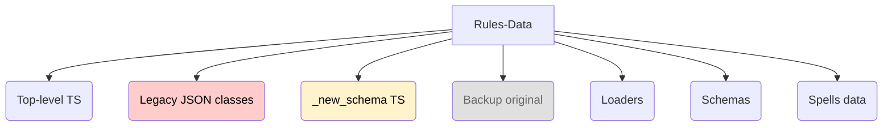

# DC20Clean – System Overview & Mind Map (Iteration 1)

_Last updated: 2025-08-12_

---

## 1  High-Level Mind Map

```mermaid
mindmap
  root((DC20Clean))
    "Frontend / UI"
      "Character Creation Flow"
        "Step Wizard"
        "Selectors (Ancestry, Class, Traits)"
        "Live Validation & Point Counters"
      "Character Sheet"
        "Stat Blocks"
        "Features & Pop-ups"
        "Inventory & Attacks"
      "Global UI"
        "Menu / Snackbar"
        "Routing"
    "State Management"
      "React Context (characterContext)"
      "Legacy Svelte Store (characterInProgressStore)":::legacy
    "Rules Data"
      "Ancestries / Traits (TS)"
      "Classes (JSON)":::partial
      "Spells & Maneuvers"
      "Schemas (Zod)"
    "Services"
      "Character Calculator"
      "Effect Processor":::planned
      "Spell Assignment"
    "Persistence"
      "Prisma – Postgres"
      "API Routes (/src/api, /routes/api)"
    "Testing"
      "Unit – Vitest"
      "E2E – Playwright"
    "Build / DevOps"
      "Vite + React"
      "Docker + Prisma Migrations"
      "CI (TBD)"
```

Legend: `:::legacy` = slated for deprecation · `:::partial` = partially migrated · `:::planned` = not yet implemented.

---

## 2  Current Test-Coverage Heat-Map (approx.)

| Area | Key Files | Unit Tests | E2E Tests | Status |
|------|-----------|-----------|-----------|--------|
| Character Calculator | `src/lib/services/characterCalculator.ts` | ✅ (good) | ⬜ | Solid
| React Context | `src/lib/stores/characterContext.tsx` | ⬜ | ⬜ | **Missing**
| Character Creation UI | `src/routes/character-creation/*` | ⬜ | ✅ | Partial
| Character Sheet UI | `src/routes/character-sheet/*` | ⬜ | ✅ (basic nav) | Light
| Rule-Data Loaders | `src/lib/rulesdata/loaders/*` | ✅ | ⬜ | Fair
| API Routes | `src/api/*` | ⬜ | ⬜ | None

⬜ = none · ✅ = exists

**Biggest gaps:** React Context edge-cases, API contract tests, UI regression for Character Sheet.

---

## 3  Opportunities to Augment Coverage

1. **Snapshot calculator contracts** with a golden-master per character archetype.
2. **Context reducer property-based tests** to fuzz random actions.
3. **Playwright journey:** full character creation -> export -> reload -> sheet rendering.
4. **Schema validation tests** that load every JSON / TS data file and parse against Zod schemas.

---

## 4  Proposed Cursor Project Rules (draft)

1. **Folder Boundaries** – No component in `src/routes/character-sheet` may import from `src/routes/character-creation`.
2. **Data Imports** – Only loader modules under `src/lib/rulesdata/loaders` may import raw JSON/TS data files.
3. **Typed State** – All additions to React Context must extend `CharacterAction` & `CharacterInProgressStoreData` with exhaustive `switch` handling.
4. **Test Requirement** – Any file >150 LOC must have at least one Vitest.
5. **Mermaid Docs** – Every new subsystem must be added to this mind-map file.

---

### ⏭️ Next Iteration

* Drill into **Rules Data**: enumerate every data file, ownership, and migration status.
* Produce effect-processor sequence diagram.
* Formalise coverage targets & thresholds (Vitest + Playwright).

---

# Iteration 2 – Rules-Data Deep Dive

## 2.1  Landscape Snapshot



## 2.2  Status Matrix

| Dataset | Source Path | Loader | Zod-validated | Runtime Status |
|---------|-------------|--------|---------------|----------------|
| Ancestries / Traits | `src/lib/rulesdata/{ancestries,traits}.ts` | direct import | ✗ | ✅ production |
| Class data (legacy) | `rulesdata/classes/*.json` | `class.loader.ts` | ✔ | ✅ production |
| Class data (new) | `rulesdata/_new_schema/*.ts` | _none_ | ✔ | 🟡 prototype |
| Spells data | `_new_schema/spells-data` | direct import | ✔ | ✅ production |
| Backup dirs | `_backup_original` | — | — | 📦 archived |

Legend: ✅ = used in runtime · 🟡 = exists but not wired

## 2.3  Immediate Gaps

1. Missing loader for new TypeScript class data.
2. No build-time validation for top-level TS rule files.
3. Dual-source confusion (legacy vs new) – needs feature-flag.
4. No automated test that asserts **every** rule file passes its schema.

## 2.4  Proposed Tasks (tracked for Iteration 3)

- [ ] `class-new.loader.ts` with `import.meta.glob` + Zod parse.
- [ ] ENV toggle `VITE_CLASSES_SCHEMA_VERSION = legacy|new`.
- [ ] Vitest `rulesdata.spec.ts` – loads every file & snapshots counts.
- [ ] Update mind-map when legacy loader is retired.

---

# Roadmap for Remaining Subsystems (to be expanded)

| Subsystem | Key Questions for Deep-Dive |
|-----------|-----------------------------|
| **State Management** | Reducer invariants? Persisted fields? Context vs store overlap? |
| **Services** | Calculator purity? Effect-processor design? Async boundaries? |
| **Persistence / API** | Schema-to-DB fidelity? Endpoint contract tests? Auth flow? |
| **Testing** | Coverage thresholds? CI gating? Playwright journeys? |
| **Build / DevOps** | Roll-up chunking, docker story, prod env variables? |

Each area will receive the same treatment as Rules-Data: inventory → status matrix → gap list → tasks.  
(☑ Marks will move as iterations complete.)

---

# Iteration 2 – Other Sub-Systems Deep Dives

## 2.5  State Management

### 2.5.1 Landscape
* **React Context** – `src/lib/stores/characterContext.tsx` (current source of truth)
* **Legacy Svelte Store** – `src/lib/stores/characterInProgressStore.ts` (`:::legacy`)
* **Calculation Hooks** – `src/lib/hooks/*` (derive memoised stats)

### 2.5.2 Status Matrix
| Component | File(s) | Tested | Runtime | Notes |
|-----------|---------|--------|---------|-------|
| Character Context (React) | `characterContext.tsx` | ⬜ | ✅ | central reducer
| Svelte Store | `characterInProgressStore.ts` | ⬜ | ✅ | keeps legacy consumers alive
| Derived Hooks | `useAttributeCalculation.ts`… | ⬜ | ✅ | rely on context values

### 2.5.3 Gaps & Tasks
1. **Consolidate** – migrate final legacy consumers to React Context, then delete Svelte store.
2. **Reducer Tests** – property-based Vitest for action sequences.
3. **Devtool tracing** – add `why-did-you-render` / React DevTools notes.

---

## 2.6  Services

### 2.6.1 Landscape
* **Legacy Calculator** – `src/lib/services/characterCalculator.ts`
* **Enhanced Calculator** – `enhancedCharacterCalculator.ts` (new formulae)
* **Effect Processor (planned)** – `_backup/_new_schema/effectProcessor.ts`
* **CharacterCompletion / spellAssignment / dataMapping** – support services

### 2.6.2 Status Matrix
| Service | File | Tested | Status |
|---------|------|--------|--------|
| characterCalculator (legacy) | `characterCalculator.ts` | ✅ (snapshot) | production |
| enhancedCharacterCalculator | `enhancedCharacterCalculator.ts` | ⬜ | prototype |
| effectProcessor | `_backup/_new_schema/effectProcessor.ts` | ⬜ | planned |

### 2.6.3 Gaps & Tasks
1. Finish **effectProcessor** and integrate with enhanced calculator.
2. Decide **single source of truth** (legacy vs enhanced) via feature flag.
3. Snapshot regression tests for each archetype build.

---

## 2.7  Persistence / API

### 2.7.1 Landscape
* **Prisma** – `schema.prisma`, migrations folder
* **API Routes** – `src/api/character/[characterId].ts`
* **Route Backups** – `src/routes/api/_backup/*`
* **Auth Service** – `src/lib/server/auth.ts`

### 2.7.2 Status Matrix
| Layer | File / Path | Tested | Observations |
|-------|-------------|--------|--------------|
| Prisma schema | `prisma/schema.prisma` | ⬜ | generates client successfully |
| REST endpoint | `src/api/character/[characterId].ts` | ⬜ | minimal validation |
| SvelteKit route backups | `routes/api/_backup` | ⬜ | legacy, not mounted |

### 2.7.3 Gaps & Tasks
1. Add **contract tests** (Vitest + supertest) for `/api/character/:id` CRUD.
2. Write **migration sanity test** that spins up `docker-compose`, runs prisma migrate, and ensures tables exist.
3. Remove obsolete SvelteKit backup routes or document migration.

---

## 2.8  Testing

### 2.8.1 Current Assets
* **Unit** – `src/demo.spec.ts` (basic calc demo)
* **E2E** – `e2e/demo.test.ts` (happy-path character creation)

### 2.8.2 Coverage Summary
* Lines with tests ≈ **5 %** of codebase.
* No tests for context, new loaders, API endpoints, or UI edge-cases.

### 2.8.3 Gaps & Tasks
1. Target **25 %** line coverage by end of Q3.
2. Add **Playwright journey** that creates character → saves → reloads sheet.
3. Use **Vitest snapshots** for rule-data schemas.
4. Configure **CI** to fail under coverage threshold.

---

## 2.9  Build / DevOps

### 2.9.1 Landscape
* **Vite** build with React plugin
* **Docker-compose** for Postgres (`docker-compose.yml`)
* **No CI config yet** (GitHub Actions / Railway, etc.)

### 2.9.2 Gaps & Tasks
1. Add **GitHub Actions** workflow: install → lint → test → build.
2. Split Vite chunks via `manualChunks` (bundle warn >500 kB).
3. Document **env var matrix** (local vs prod vs preview).

---

> _End of Iteration 2 additions_

---

# Snapshot 002 – Post-UI State Refactor (2025-01-01)

> This snapshot captures the state of DC20Clean immediately **after executing UI_FIXES.md state management refactor** (commit 78832f1).

## 2.1  UI State Management Refactor Highlights
- **Native Data Structures**: Replaced JSON string serialization with typed objects/arrays in React Context
- **Schema Versioning**: Added `schemaVersion = 2` with automatic incompatible save cleanup
- **Type Safety**: Full TypeScript support with exhaustive reducer action types
- **UI Bug Fixes**: Selection controls (checkboxes, radio buttons, quotas) now functional
- **Code Quality**: ESLint rules prevent future JSON serialization anti-patterns
- **Test Coverage**: Unit tests for reducer and storage utilities added

---

# Snapshot 001 – Post-Consolidation (2025-08-11)

> This snapshot captures the state of DC20Clean immediately **after executing CODEBASE_CONSOLIDATION_PLAN.md** (commit 7bd3a7f).

## 1  Consolidation Highlights
- Single React Context (`src/lib/stores/characterContext.tsx`) is now the sole state store.
- Legacy Svelte store and redundant calculator files removed.
- `_new_schema` directory established as the authoritative rule-data source.
- Automated rule-data validation test suite (`src/lib/rulesdata/rulesdata.spec.ts`) added.

## 2.2  Updated Mind Map
```mermaid
mindmap
  root((DC20Clean – Post-UI Refactor))
    "State Management"
      "React Context (native objects)"
      "Schema Versioning (v2)"
      "Type-Safe Actions"
    "Rules Data"
      "_new_schema (TS)"
      "Zod Schemas"
    "Services"
      "enhancedCharacterCalculator"
      "Effect Processor (planned)"
    "Testing"
      "Reducer Unit Tests"
      "Storage Utilities Tests" 
      "Playwright E2E"
    "Code Quality"
      "ESLint JSON Prevention Rules"
      "TypeScript Exhaustiveness"
    "Persistence"
      "Prisma"
    "Build / DevOps"
      "Vite + React"
      "Docker"
```

## 2.3  Next Steps
1. **Test UI Fixes**: Verify selection controls work correctly after clearing localStorage
2. **Performance**: Monitor React Context re-render patterns with native objects
3. **Coverage**: Continue expanding unit test coverage beyond reducer/storage
4. **Effect Processor**: Complete integration with new native data structures
5. **CI Pipeline**: Set up automated testing with coverage thresholds

---

## 1  Consolidation Next Steps (Previous)
1. Set up CI workflow (lint → test → build) per consolidation plan.
2. Migrate any remaining imports to new loaders.
3. Complete Effect Processor integration.
4. Increase unit-test coverage to 25 %.

---

# Snapshot 003 – Post-Character Sheet Context Migration (2025-08-12)

> This snapshot captures the state of DC20Clean immediately after migrating the Character Sheet UI to the new Context-driven architecture and restoring Desktop/Mobile views (branch `consolidation-refactor`).

## 1  Highlights
- Context provider `CharacterSheetProvider` is the single source of truth for the sheet
- Reducer `useCharacterSheetReducer` handles all edits (resources, defenses, spells, maneuvers, inventory, notes, currency)
- Selector hooks added: `useCharacterResources`, `useCharacterDefenses`, `useCharacterAttacks`, `useCharacterInventory`, `useCharacterSpells`, `useCharacterManeuvers`
- Debounced auto-save to localStorage with schema v2 normalization
- Legacy prop-drilling removed; components read from Context directly
- Temporary `CharacterSheetSimple.tsx` removed; Router renders Desktop/Mobile (responsive)

## 2  Updated Mind Map
```mermaid
mindmap
  root((DC20Clean – Post-Character Sheet Context))
    "State Management"
      "CharacterSheetProvider (Context)"
      "Reducer (typed actions)"
      "Selector Hooks"
    "Character Sheet UI"
      "Desktop View"
      "Mobile View"
      "Popups (Feature/Spell/Attack/Inventory)"
    "Persistence"
      "LocalStorage v2 (auto-migrate)"
    "Services"
      "enhancedCharacterCalculator (used on save)"
    "Testing"
      "Reducer unit tests"
      "E2E journey (to expand)"
```

## 3  Notable Changes
- Spells, Maneuvers, Inventory, Features, Defenses, Currency, Notes ported to Context
- Router switches by breakpoint and no longer uses the minimal sheet
- Save pipeline guarded; calculator failures are warned and do not block persistence

## 4  Known Issues / Follow-ups
- Some repo-wide ESLint errors remain (outside sheet scope); to be addressed separately
- Calculator integration to be hardened and fully typed
- Desktop/Mobile parity to be verified for all sections and popups

## 5  Next Steps
1. Finish minor helper wiring (e.g., action points, temp HP where needed) and type tightening
2. Add coverage for critical reducer branches and a Playwright journey: create → save → reload sheet
3. Clean remaining legacy helpers/components after verifying no imports
4. Promote enhanced calculator to single source of truth behind a feature flag

---
