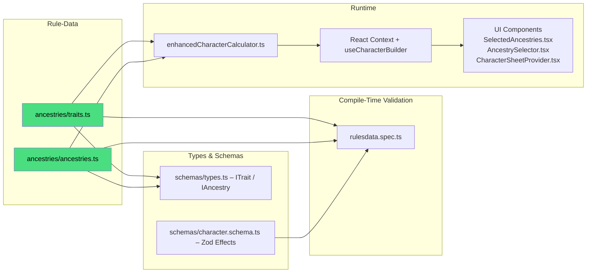

# DC20Clean – Ancestry & Trait System

> Purpose: Single reference for Ancestries and Traits: data pipeline, effect typing, and selection UI.
> Status: Active
> Last Updated: 2026-02-06

---

## 1 High-Level Pipeline



---

## 2 Key Files & Their Roles

| Layer                     | File / Dir                                                                                | Responsibility                                             |
| ------------------------- | ----------------------------------------------------------------------------------------- | ---------------------------------------------------------- |
| **Rule Data (canonical)** | `src/lib/rulesdata/ancestries/traits.ts`                                                  | Declarative list of `traitsData` objects                   |
|                           | `src/lib/rulesdata/ancestries/ancestries.ts`                                              | Declarative list of `ancestriesData` (16 ancestries)       |
|                           | `src/lib/rulesdata/ancestries/sharedTraits.ts`                                            | Shared trait definitions used across ancestries            |
| **Type Contracts**        | `src/lib/rulesdata/schemas/types.ts`                                                      | TS interfaces `ITrait`, `IAncestry`, `ITraitEffect`        |
|                           | `src/lib/rulesdata/schemas/character.schema.ts`                                           | Zod schema used for validation & effect typing             |
| **Validation Tests**      | `src/lib/rulesdata/rulesdata.spec.ts`                                                     | Loads every trait / ancestry and asserts schema compliance |
| **Runtime Engine**        | `src/lib/services/enhancedCharacterCalculator.ts`                                         | Aggregates effects, resolves choices, outputs stats        |
| **State Layer**           | `src/lib/stores/characterContext.tsx`<br>`src/lib/hooks/useCharacterBuilder.ts`           | Provides calculated results to UI                          |
| **UI**                    | `src/routes/character-creation/*` (selection)<br>`src/routes/character-sheet/*` (display) | Import `ancestriesData` / `traitsData` directly            |

Note: Class features can modify ancestry budgets via effects (e.g., Cleric “Ancestral” domain adds `+2` to `ancestryPoints`). Ensure such effects are applied before spending ancestry points.

---

## 3 Adding **New Ancestry** – Checklist ✅

1. **Data**  
   1.1 Append the ancestry object to `ancestries/ancestries.ts`  
   ‑ `id`, `name`, `description`, `defaultTraitIds`, `expandedTraitIds`.
   ‑ `rulesSource` (string, e.g., `DC20Beta0.95`).
2. **Traits**  
   2.1 Create each new trait in `ancestries/traits.ts`  
   ‑ Use unique `id = '<ancestryId>_<snake_case_trait>'`.  
   ‑ Ensure `cost`, `description`, and `effects` array.  
   2.2 ⚠️ **Human-in-the-loop review required**: First attempt to reuse existing `effect.type` strings. If a new type seems unavoidable, a maintainer must review and approve the required engine & schema changes (see §4).
3. **Types / Schema**  
   3.1 If a new `effect.type` is invented, add to Zod schema in `character.schema.ts` **and** implement logic in `enhancedCharacterCalculator.ts`.
4. **Calculator Support**  
   4.1 If the effect is **numeric** → map in `createStatBreakdown` or similar.  
   4.2 If it’s an **ability** → emit as `GRANT_ABILITY` (requires no engine change).
5. **UI**  
   5.1 No code changes: components import arrays directly.  
   5.2 Edge-cases: add banner images / icons if needed.
6. **Tests**  
   6.1 Run `npm run test:unit`; `rulesdata.spec.ts` will fail on schema violations.  
   6.2 Add a specific calculation test if the trait is complex.
7. **Docs**  
   7.1 Append a bullet to this file under “Next Ancestries Added”.
8. **Commit Message Template**
   ```
   feat(rules): add <AncestryName> ancestry & N traits
   - traits.ts: +N entries
   - ancestries.ts: +1 entry
   - tests: update counts
   ```

---

## 4 Adding **New Trait Effect Type** – Decision Matrix

| Question                                           | Yes                                                               | No                                      |
| -------------------------------------------------- | ----------------------------------------------------------------- | --------------------------------------- |
| Does an existing `effect.type` cover the mechanic? | Use it → go to Step 3.1                                           | Create new type → continue              |
| Does the effect alter a **numeric stat**?          | Implement in calculator (`createStatBreakdown`)                   | Use `GRANT_ABILITY` + manual rules text |
| Does the UI need to resolve **user choice**?       | Add `userChoiceRequired` in trait & update `resolveEffectChoices` | —                                       |

**When new type is created**:

1. Extend `ITraitEffect.type` JSDoc comment (open list).
2. Extend Zod schema validation.
3. Implement logic in calculator.
4. Write unit test(s).

---

## 5 Troubleshooting FAQ 🤖

| Symptom                                     | Likely Cause                                          | Fix                                     |
| ------------------------------------------- | ----------------------------------------------------- | --------------------------------------- |
| **Vite import error** for traits/ancestries | File path typo (should be `ancestries/...`)           | Search `import .*rulesdata/traits` etc. |
| New ancestry not visible in UI              | Not added to `ancestries/ancestries.ts` or wrong `id` | Check default/expanded trait IDs        |
| Unit test `rulesdata.spec.ts` fails         | Schema violation (missing field / wrong effect)       | Inspect test output & update data       |
| Stats not updating for new effect           | Effect type not handled in calculator                 | Add case to `createStatBreakdown`       |

---

## 6 Testing 🧪

### 6.1 Test Suite

**Location**: `src/lib/rulesdata/ancestries/ancestries.test.ts`

**Coverage**: 34 comprehensive tests validating:

#### Data Structure & Schema Compliance

- ✅ Ancestry data loads successfully
- ✅ All required fields present (`id`, `name`, `description`, `rulesSource`, `defaultTraitIds`, `expandedTraitIds`)
- ✅ Unique ancestry IDs and names
- ✅ **Non-empty trait lists** (every ancestry must have at least one trait)
- ✅ Valid `rulesSource` values
- ✅ Trait data loads successfully
- ✅ All required trait fields present (`id`, `name`, `description`, `cost`, `effects`)
- ✅ Unique trait IDs
- ✅ Valid cost values (numeric)
- ✅ Non-empty effects arrays

#### ID Format & Naming Conventions

- ✅ `ancestry_trait` naming convention followed
- ✅ `snake_case` for ancestry IDs
- ✅ Trait ID prefixes match ancestry IDs

#### Trait-to-Ancestry Relationships

- ✅ All referenced traits exist in `defaultTraitIds`
- ✅ All referenced traits exist in `expandedTraitIds`
- ✅ No duplicates between default and expanded
- ✅ No duplicate trait IDs within lists
- ✅ **Zero orphaned traits** (all traits referenced by at least one ancestry)

#### Effect System Validation

- ✅ Only valid effect types used
- ✅ Valid target values for `MODIFY_STAT` effects
- ✅ Numeric values for numeric effect types
- ✅ Proper `userChoice` structure for choice-based effects
- ✅ **All effects have required `target` field**

#### Cost & Budget Validation

- ✅ Default trait costs calculate correctly (should equal 5 for most ancestries)
- ✅ Valid costs for negative traits (negative values, `isNegative: true`)
- ✅ Consistent cost structure across all traits

#### Schema Compliance

- ✅ Valid optional fields when present
- ✅ Valid effect structure for all effects

#### Data Coverage Statistics

- ✅ Reports total ancestry count (16)
- ✅ Reports total trait count (244)
- ✅ Reports trait distribution per ancestry
- ✅ Reports effect type usage distribution
- ✅ Reports cost distribution

### 6.2 Running Tests

```bash
# Run ancestry tests only
npm run test:unit -- ancestries.test.ts

# Run all unit tests
npm run test:unit

# Run with UI (useful for debugging)
npm run test:unit -- ancestries.test.ts --ui
```

### 6.3 Test-Driven Data Quality

The test suite enforces strict data quality rules:

- **No placeholder ancestries**: Every ancestry must have traits defined
- **No orphaned traits**: Every trait must be referenced by at least one ancestry
- **No missing references**: All trait IDs in ancestry lists must exist
- **Strict schema**: All effects must have `type`, `target`, and `value` fields
- **Naming conventions**: IDs must follow `ancestry_trait` pattern

### 6.4 When Tests Fail

| Test Failure                            | Common Causes                                    | Fix                                             |
| --------------------------------------- | ------------------------------------------------ | ----------------------------------------------- |
| "should have non-empty trait lists"     | Added ancestry with empty trait arrays           | Add traits or remove placeholder ancestry       |
| "should reference only existing traits" | Typo in trait ID, or trait not defined           | Fix ID or create the missing trait              |
| "should not have orphaned traits"       | Trait defined but not referenced by any ancestry | Add to an ancestry's trait list or remove trait |
| "should have valid effect structure"    | Missing `target` field in effect                 | Add `target` field (not `count` or `options`)   |
| "should follow ancestry_trait naming"   | Trait ID doesn't match `ancestry_trait` pattern  | Rename trait ID to match pattern                |

---

## 7 Beastborn Traits

The Beastborn ancestry includes a diverse set of traits representing various animal adaptations. Recent additions include:

- `beastborn_web_walk` — Walk on webs and similar surfaces
- `beastborn_prehensile_tail` — Use tail as an additional limb
- `beastborn_camouflage` — Blend into natural environments
- `beastborn_echolocation` — Navigate using sound waves
- `beastborn_pack_tactics` — Gain advantage when fighting alongside allies

### 7.1 Prerequisite Patterns: `requirements.hasTrait`

Some traits use the `requirements.hasTrait` pattern for "any-of" prerequisites (OR logic), which supersedes the simple `prerequisites` array. This allows a trait to require any one of multiple possible traits:

```typescript
{
  id: 'beastborn_enhanced_flight',
  name: 'Enhanced Flight',
  prerequisites: ['beastborn_winged_arms'], // Legacy: requires this specific trait
  // OR
  requirements: {
    hasTrait: ['beastborn_winged_arms', 'beastborn_webbed_hands'] // Requires ANY of these traits
  }
}
```

When `requirements.hasTrait` is present, the trait requires any ONE of the listed traits to be selected (OR logic), making it more flexible than the single-trait `prerequisites` array.

## 8 Variant Traits

Some ancestries have `variantTraits` arrays containing alternative trait sets. These are not separate ancestries but optional trait replacements:

- `angelborn` → `angelborn_fallen` variant
- `fiendborn` → `fiendborn_redeemed` variant

Variant traits follow the same schema as regular traits and are available for selection alongside default/expanded traits.

---

## 9 Future Evolution

- **Effect Processor** integration will further centralise logic—update §3 Step 4 when landed.
- **Schema-driven forms** may auto-render trait editors using this document's file maps.

---

> _Last updated: 2026-02-06_  
> Maintainer: @DC20Clean-Team
