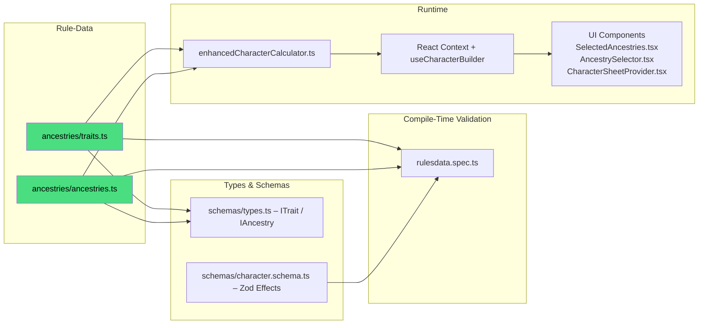

# DC20Clean – Ancestry & Trait System (Vertical Slice)

> **Purpose**  
> This document is the _single authoritative reference_ (“bible”) for everything related to **Ancestries** and **Traits**.  
> • Humans can follow the numbered guides & check-lists.  
> • AI agents can parse the 🗂 _File Maps_ and ⬢ _Mermaid_ graphs to discover dependencies.

---

## 1 High-Level Pipeline



---

## 2 Key Files & Their Roles

| Layer                     | File / Dir                                                                                | Responsibility                                             |
| ------------------------- | ----------------------------------------------------------------------------------------- | ---------------------------------------------------------- |
| **Rule Data (canonical)** | `src/lib/rulesdata/ancestries/traits.ts`                                                 | Declarative list of `traitsData` objects                   |
|                           | `src/lib/rulesdata/ancestries/ancestries.ts`                                             | Declarative list of `ancestriesData` objects               |
| **Type Contracts**        | `src/lib/rulesdata/schemas/types.ts`                                                              | TS interfaces `ITrait`, `IAncestry`, `ITraitEffect`        |
|                           | `src/lib/rulesdata/schemas/character.schema.ts`                                           | Zod schema used for validation & effect typing             |
| **Validation Tests**      | `src/lib/rulesdata/rulesdata.spec.ts`                                                     | Loads every trait / ancestry and asserts schema compliance |
| **Runtime Engine**        | `src/lib/services/enhancedCharacterCalculator.ts`                                         | Aggregates effects, resolves choices, outputs stats        |
| **State Layer**           | `src/lib/stores/characterContext.tsx`<br>`src/lib/hooks/useCharacterBuilder.ts`           | Provides calculated results to UI                          |
| **UI**                    | `src/routes/character-creation/*` (selection)<br>`src/routes/character-sheet/*` (display) | Import `ancestriesData` / `traitsData` directly            |

Note: Class features can modify ancestry budgets via effects (e.g., Cleric “Ancestral” domain adds `+2` to `ancestryPoints`). Ensure such effects are applied before spending ancestry points.

---

## 3 Adding **New Ancestry** – Checklist ✅

1. **Data**  
   1.1 Append the ancestry object to `ancestries/ancestries.ts`  
   ‑ `id`, `name`, `description`, `defaultTraitIds`, `expandedTraitIds`.
   ‑ `rulesSource` (string, e.g., `DC20Beta0.95`).
2. **Traits**  
   2.1 Create each new trait in `ancestries/traits.ts`  
   ‑ Use unique `id = '<ancestryId>_<snake_case_trait>'`.  
   ‑ Ensure `cost`, `description`, and `effects` array.  
   2.2 ⚠️ **Human-in-the-loop review required**: First attempt to reuse existing `effect.type` strings. If a new type seems unavoidable, a maintainer must review and approve the required engine & schema changes (see §4).
3. **Types / Schema**  
   3.1 If a new `effect.type` is invented, add to Zod schema in `character.schema.ts` **and** implement logic in `enhancedCharacterCalculator.ts`.
4. **Calculator Support**  
   4.1 If the effect is **numeric** → map in `createStatBreakdown` or similar.  
   4.2 If it’s an **ability** → emit as `GRANT_ABILITY` (requires no engine change).
5. **UI**  
   5.1 No code changes: components import arrays directly.  
   5.2 Edge-cases: add banner images / icons if needed.
6. **Tests**  
   6.1 Run `npm run test:unit`; `rulesdata.spec.ts` will fail on schema violations.  
   6.2 Add a specific calculation test if the trait is complex.
7. **Docs**  
   7.1 Append a bullet to this file under “Next Ancestries Added”.
8. **Commit Message Template**
   ```
   feat(rules): add <AncestryName> ancestry & N traits
   - traits.ts: +N entries
   - ancestries.ts: +1 entry
   - tests: update counts
   ```

---

## 4 Adding **New Trait Effect Type** – Decision Matrix

| Question                                           | Yes                                                               | No                                      |
| -------------------------------------------------- | ----------------------------------------------------------------- | --------------------------------------- |
| Does an existing `effect.type` cover the mechanic? | Use it → go to Step 3.1                                           | Create new type → continue              |
| Does the effect alter a **numeric stat**?          | Implement in calculator (`createStatBreakdown`)                   | Use `GRANT_ABILITY` + manual rules text |
| Does the UI need to resolve **user choice**?       | Add `userChoiceRequired` in trait & update `resolveEffectChoices` | —                                       |

**When new type is created**:

1. Extend `ITraitEffect.type` JSDoc comment (open list).
2. Extend Zod schema validation.
3. Implement logic in calculator.
4. Write unit test(s).

---

## 5 Troubleshooting FAQ 🤖

| Symptom                                     | Likely Cause                                           | Fix                                     |
| ------------------------------------------- | ------------------------------------------------------ | --------------------------------------- |
| **Vite import error** for traits/ancestries | File path typo (should be `ancestries/...`)           | Search `import .*rulesdata/traits` etc. |
| New ancestry not visible in UI              | Not added to `ancestries/ancestries.ts` or wrong `id` | Check default/expanded trait IDs        |
| Unit test `rulesdata.spec.ts` fails         | Schema violation (missing field / wrong effect)        | Inspect test output & update data       |
| Stats not updating for new effect           | Effect type not handled in calculator                  | Add case to `createStatBreakdown`       |

---

## 6 Future Evolution

- **Effect Processor** integration will further centralise logic—update §3 Step 4 when landed.
- **Schema-driven forms** may auto-render trait editors using this document’s file maps.

---

> _Last updated: 2025-01-15_  
> Maintainer: @DC20Clean-Team
