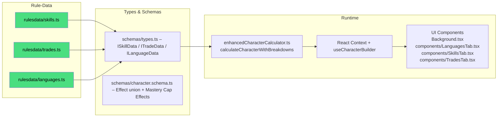

# DC20Clean – Background System (Skills, Trades, Languages)

> Purpose  
> This document is the single authoritative reference ("bible") for everything related to Background: Skill/Trade/Language data, point budgets, conversions, validation, and UI wiring.
> • Humans can follow the numbered guides & check-lists.  
> • AI agents can parse the File Maps and Mermaid graphs to discover dependencies.

---

## 1 High-Level Pipeline



---

## 2 Key Files & Their Roles

| Layer                 | File / Dir                                              | Responsibility                                                                          |
| --------------------- | ------------------------------------------------------- | --------------------------------------------------------------------------------------- |
| Rule Data (canonical) | `src/lib/rulesdata/skills.ts`                           | Declarative `skillsData` array                                                          |
|                       | `src/lib/rulesdata/trades.ts`                           | Declarative `tradesData` array (see also `docs/archive/TRADES_MULTI_ATTRIBUTE_SPEC.md`) |
|                       | `src/lib/rulesdata/languages.ts`                        | Declarative `languagesData` array                                                       |
| Type Contracts        | `src/lib/rulesdata/schemas/types.ts`                    | `ISkillData`, `ITradeData`, `ILanguageData`                                             |
| Runtime Engine        | `src/lib/services/enhancedCharacterCalculator.ts`       | Computes base budgets, applies trait bonuses, conversions, and usage                    |
| State Layer           | `src/lib/stores/characterContext.tsx`                   | Stores background point allocations and conversion counts                               |
| Hook                  | `src/lib/hooks/useCharacterBuilder.ts`                  | Runs calculator and returns `calculationResult.background`                              |
| UI                    | `src/routes/character-creation/Background.tsx` and tabs | Renders editors for skills/trades/languages                                             |

---

## 3 Data Shapes

- Skills: `ISkillData { id, name, attributeAssociation, description }`
- Trades: `ITradeData { id, name, primaryAttribute, attributeAssociations[], description, tools? }`
  - For multi-attribute trades, see `docs/archive/TRADES_MULTI_ATTRIBUTE_SPEC.md` (canonical field: `attributeAssociations: string[]`).
- Languages: `ILanguageData { id, name, type: 'standard'|'exotic', description }`

Background allocations in store:

- `skillsData: Record<string, number>` – mastery levels per skill
- `tradesData: Record<string, number>` – mastery levels per trade
- `languagesData: Record<string, { fluency: 'limited' | 'fluent' }>` – per-language fluency
- Conversions: `{ skillToTrade, tradeToSkill, tradeToLanguage }` numbers on the store

---

### Acceptance Criteria (Background)

- Conversions follow documented formulas; over-budget states disable submit and surface errors.
- Mastery cap validation emits `MASTERY_CAP_EXCEEDED` unless exceptions are granted.

## 4 Calculation Model

Within `calculateCharacterWithBreakdowns`:

- Base budgets (Level 1 defaults):
  - Skill Points = `5 + Intelligence + bonus('skillPoints')`
  - Trade Points = `3 + bonus('tradePoints')`
  - Language Points = `2 + bonus('languagePoints')`
- Conversions applied:
  - `availableSkillPoints = baseSkillPoints - skillToTrade + floor(tradeToSkill/2)`
  - `availableTradePoints = baseTradePoints - tradeToSkill + skillToTrade*2 - tradeToLanguage`
  - `availableLanguagePoints = baseLanguagePoints + tradeToLanguage*2`
- Usage:
  - `skillPointsUsed = sum(levels in skillsData)`
  - `tradePointsUsed = sum(levels in tradesData)`
  - `languagePointsUsed = sum(fluency costs; limited=1, fluent=2; 'common' free)`
- **Mastery Cap Validation** ✅ **NEW**:
  - Determines baseline mastery tier from character level
  - Identifies skills/trades exceeding baseline cap
  - Collects `MODIFY_SKILL_MASTERY_CAP` and `INCREASE_SKILL_MASTERY_CAP` effects
  - Validates exception budget and specific skill coverage
  - Emits `MASTERY_CAP_EXCEEDED` and `INVALID_MASTERY_GRANT` errors
  - All characters have 1 base Adept slot by default; raising additional skills/trades to Adept requires granted exceptions
- Validation emits over-budget errors by step.

Traits can modify these pools using effects:

- `MODIFY_STAT` targets: `skillPoints`, `tradePoints`, `languagePoints`
- **Mastery Cap Effects** ✅ **NEW**:
  - `MODIFY_SKILL_MASTERY_CAP` / `MODIFY_TRADE_MASTERY_CAP`: Grant specific tier unlocks
  - `INCREASE_SKILL_MASTERY_CAP` / `INCREASE_TRADE_MASTERY_CAP`: Increase cap by value

The calculator exposes a `background` block with:  
`{ baseSkillPoints, baseTradePoints, baseLanguagePoints, availableSkillPoints, availableTradePoints, availableLanguagePoints, skillPointsUsed, tradePointsUsed, languagePointsUsed, conversions }`.

Denormalized outputs persisted on `SavedCharacter` (for UI/PDF consumption) — additive/optional fields introduced by Task 0:

- `skillTotals: Record<skillId, number>`
- `skillMastery: Record<skillId, { governingAttributes, baseAttributeValues, masteryLevel, masteryLadder, finalValue }>`
- `knowledgeTradeMastery: Record<'arcana'|'history'|'nature'|'occultism'|'religion', ...>`
- `masteryLadders: { skills, knowledgeTrades, practicalTrades: { A..D: { label, ladder, finalValue } } }`
- `languageMastery: { A..D: { name, limited, fluent } }`
- `bloodiedValue`, `wellBloodiedValue`, and PD/AD heavy/brutal thresholds

Transformer note: `src/lib/pdf/transformers.ts` reads these fields when present and only falls back to legacy math if they are missing, ensuring backward compatibility.

Validation also exposes a `masteryLimits` block with:  
`{ maxSkillMastery, maxTradeMastery, currentAdeptCount, maxAdeptCount, canSelectAdept }`. At level 1, `maxAdeptCount` is 1 (base Adept slot) plus any granted exceptions.

---

## 5 Adding/Modifying Background Data – Checklist ✅

1. Data  
   1.1 Add or edit entries in `skills.ts`, `trades.ts`, or `languages.ts`.  
   – Keep `id` stable; prefer kebab/underscore-free, lowercase IDs.  
   – Ensure `attributeAssociation` is one of: `might | agility | charisma | intelligence | prime` (skills only).

2. Points & Conversions  
   – To change defaults, update formulas in `enhancedCharacterCalculator.ts` (§4).  
   – To add new conversion rules, extend the `conversions` structure in store and calculator consistently.

3. Trait Bonuses  
   – Reuse `MODIFY_STAT` to target `skillPoints`, `tradePoints`, or `languagePoints`.  
   – If a new pool is introduced, update `Effect.target` doc, calculator aggregation, and UI.

4. UI Wiring  
   – UI components should read `calculationResult.background` and disable submit when over budget.  
   – Languages: treat `common` as always fluent and free unless rules change.

5. Tests  
   – Add unit tests for any formula changes or new conversions.  
   – Run `npm run test:unit`.

6. Commit Message Template
   ```
   feat(background): update <skills|trades|languages> definitions and budgets
   - rulesdata/<file>.ts: +N updates
   - calculator: adjust background formulas
   - tests: add coverage for conversions and budgets
   ```

---

## 6 Troubleshooting FAQ 🤖

| Symptom                                      | Likely Cause                                   | Fix                                                                   |
| -------------------------------------------- | ---------------------------------------------- | --------------------------------------------------------------------- |
| Over-budget errors even with minimal choices | Conversion math or base budget regression      | Re-check §4 formulas and state conversions wiring                     |
| Language points miscounting                  | `common` included in cost                      | Ensure `common` is excluded from `languagePointsUsed` calc            |
| Trait background bonuses not applied         | Missing `MODIFY_STAT` handling for pool target | Ensure target matches one of `skillPoints/tradePoints/languagePoints` |
| New pool not reflected in UI                 | UI not reading calculator `background`         | Update components to use `calculationResult.background`               |

---

## 7 Future Evolution

- Schema-driven editors for Skills/Trades/Languages.
- ✅ **COMPLETED**: Mastery cap validation and granular control implemented
- UI enhancements: Dynamic mastery cap indicators in skill/trade selection

---

> Last updated: 2026-01-25  
> Maintainer: @DC20Clean-Team
