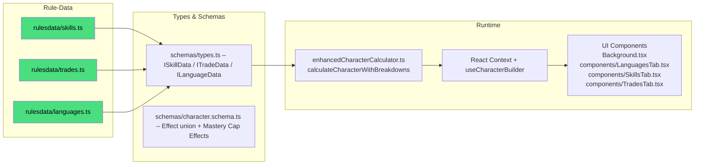

# DC20Clean – Background System (Skills, Trades, Languages)

> Last Updated: 2026-06-27
>
> Purpose  
> This document is the single authoritative reference ("bible") for everything related to Background: Skill/Trade/Language data, point budgets, conversions, validation, and UI wiring.
> • Humans can follow the numbered guides & check-lists.  
> • AI agents can parse the File Maps and Mermaid graphs to discover dependencies.

---

## 1 High-Level Pipeline


```mermaid
flowchart LR
    subgraph Rule-Data
        A1[rulesdata/skills.ts]
        A2[rulesdata/trades.ts]
        A3[rulesdata/languages.ts]
        style A1 fill:#4ade80,color:#000
        style A2 fill:#4ade80,color:#000
        style A3 fill:#4ade80,color:#000
    end

    subgraph Types & Schemas
        B1[schemas/types.ts – ISkillData / ITradeData / ILanguageData]
        B2[schemas/character.schema.ts – Effect union + Mastery Cap Effects]
    end

    A1 & A2 & A3 --> B1

    subgraph Runtime
        D1[enhancedCharacterCalculator.ts<br/>calculateCharacterWithBreakdowns]
        D2[React Context + useCharacterBuilder]
        D3[UI Components<br/>Background.tsx<br/>components/LanguagesTab.tsx<br/>components/SkillsTab.tsx<br/>components/TradesTab.tsx]
    end

    B1 --> D1 --> D2 --> D3
```

---

## 2 Key Files & Their Roles

| Layer                 | File / Dir                                                 | Responsibility                                                                          |
| --------------------- | ---------------------------------------------------------- | --------------------------------------------------------------------------------------- |
| Rule Data (canonical) | `src/lib/rulesdata/skills.ts`                              | Declarative `skillsData` array                                                          |
|                       | `src/lib/rulesdata/trades.ts`                              | Declarative `tradesData` array (see also `docs/archive/TRADES_MULTI_ATTRIBUTE_SPEC.md`) |
|                       | `src/lib/rulesdata/languages.ts`                           | Declarative `languagesData` array                                                       |
|                       | `scripts/background/dc20-0105-background.mjs`              | Source parser/audit generator for the v0.10.5 background chapter                        |
|                       | `scripts/background/dc20-0105-background-names.ts`         | App-data name validator for skills, trades, and languages against the generated report  |
|                       | `scripts/background/dc20-0105-background-trait-effects.ts` | Trait impact audit for Background point pools and mastery caps                          |
|                       | `docs/migration/background-v0105-report.json`              | Generated source audit report for skills, trades, languages, budgets, and conversions   |
|                       | `docs/migration/background-trait-effects-v0105.json`       | Generated report of ancestry trait effects that modify Background                       |
| Type Contracts        | `src/lib/rulesdata/schemas/types.ts`                       | `ISkillData`, `ITradeData`, `ILanguageData`                                             |
| Runtime Engine        | `src/lib/services/enhancedCharacterCalculator.ts`          | Computes base budgets, applies trait bonuses, conversions, and usage                    |
| State Layer           | `src/lib/stores/characterContext.tsx`                      | Stores background point allocations and conversion counts                               |
| Hook                  | `src/lib/hooks/useCharacterBuilder.ts`                     | Runs calculator and returns `calculationResult.background`                              |
| UI                    | `src/routes/character-creation/Background.tsx` and tabs    | Renders editors for skills/trades/languages                                             |

---

## 3 Data Shapes

- Skills: `ISkillData { id, name, attributeAssociation, description }`
- Trades: `ITradeData { id, name, primaryAttribute, attributeAssociations[], description, tools? }`
  - For multi-attribute trades, see `docs/archive/TRADES_MULTI_ATTRIBUTE_SPEC.md` (canonical field: `attributeAssociations: string[]`).
- Languages: `ILanguageData { id, name, family: 'mortal'|'exotic'|'divine'|'outer', description, typicalSpeakers, checkDc, legacyIds? }`

Background allocations in store:

- `skillsData: Record<string, number>` – mastery levels per skill
- `tradesData: Record<string, number>` – mastery levels per trade
- `languagesData: Record<string, { fluency: 'limited' | 'fluent' }>` – per-language fluency
- `skillMasteryLimitElevations: Record<string, { source: 'spent_points'; value: number }>` – extra Skill Points spent to raise a specific Skill's mastery limit
- `tradeMasteryLimitElevations: Record<string, { source: 'spent_points'; value: number }>` – extra Trade Points spent to raise a specific Trade's mastery limit
- Conversions: `{ skillToTrade, tradeToSkill, tradeToLanguage }` numbers on the store

Persistence note: `skillMasteryLimitElevations` and `tradeMasteryLimitElevations` are written to the
saved character root by `characterCompletion.ts` (always present, default `{}`). They must be declared
in `convex/schema.ts` `characterValidator` — Convex strict-validates documents on insert, so any
undeclared root field makes `characters.create` throw a generic `Server Error`. Both are stored as
`v.optional(v.record(v.string(), v.object({ source: v.string(), value: v.number() })))`. After editing
the schema, redeploy the Convex backend (`npx convex deploy`) or prod will keep rejecting new characters.

Source-audit note: v0.10.5 explicitly supports `skillToTrade` and `tradeToLanguage`.
`tradeToSkill` is not a legal source conversion. It is retained only as a legacy/undo
field and is normalized by the calculator so it can cancel prior `skillToTrade` entries
but can never create Skill Points from base Trade Points.

DC20 0.10.5 language catalog notes:

- Selectable languages come from the official 0.10.5 families: Mortal, Exotic, Divine, and Outer.
- Limited-language checks use family DCs from the rules text: Mortal 10, Exotic 15, Divine 15, Outer 20.
- Legacy save IDs are preserved where practical for unchanged entries, and renamed families may expose alias metadata (`legacyIds`) so the current picker can surface old selections without reintroducing retired names into the catalog.
- Saved legacy aliases, such as `primordial`, display with the current canonical catalog name (`Elemental`) in creator, sheet, and export surfaces.
- The explicit v0.10 upgrade reports both sides of consolidated languages before confirmation. When Abyssal and Infernal both convert to Fiendish, the converter keeps the strongest purchased fluency.
- Unsupported legacy selections (for example `goblin` or `undercommon`) are disclosed as removals before confirmation, excluded from the migrated copy so their points are available for reselection, and preserved on the locked legacy source record.

---

### Acceptance Criteria (Background)

- Conversions follow documented formulas; over-budget states disable submit and surface errors.
- Mastery cap validation emits `MASTERY_CAP_EXCEEDED` unless the allocation has a point-bought elevation or a feature/trait/talent cap increase.

## 4 Calculation Model

Within `calculateCharacterWithBreakdowns`:

- Base budgets (Level 1 defaults):
  - Skill Points = `5 + Intelligence + bonus('skillPoints')`
  - Trade Points = `3 + bonus('tradePoints')`
  - Language Points = `2 + bonus('languagePoints')`
- Conversions applied:
  - `tradeToSkillUndo = min(tradeToSkill, skillToTrade*2)`
  - `effectiveSkillToTrade = skillToTrade - floor(tradeToSkillUndo/2)`
  - `availableSkillPoints = baseSkillPoints - effectiveSkillToTrade`
  - `availableTradePoints = baseTradePoints + effectiveSkillToTrade*2 - tradeToLanguage`
  - `availableLanguagePoints = baseLanguagePoints + tradeToLanguage*2`
- Usage:
  - `skillPointsUsed = sum(levels in skillsData) + sum(spent skill mastery limit elevations)`
  - `tradePointsUsed = sum(levels in tradesData) + sum(spent trade mastery limit elevations)`
  - `languagePointsUsed = sum(fluency costs; limited=1, fluent=2; 'common' free)`
- **Mastery Cap Validation** ✅ **NEW**:
  - Determines baseline mastery tier from character level
  - Identifies skills/trades exceeding baseline cap
  - Applies point-bought limit elevations from `skillMasteryLimitElevations` and `tradeMasteryLimitElevations`
  - Collects `MODIFY_SKILL_MASTERY_CAP` and `INCREASE_SKILL_MASTERY_CAP` effects
  - Validates feature/trait/talent increase budget and specific skill coverage
  - Generic feature cap grants, such as Human Skill Expertise, are allocated to over-baseline selections that do not already have a point-bought elevation; option-specific cap grants still conflict with point-bought elevations on the same Skill/Trade.
  - Emits `MASTERY_CAP_EXCEEDED` and `INVALID_MASTERY_GRANT` errors
  - A level 1 character can raise a Skill from no Mastery to Adept by spending 3 Skill Points: 1 for Novice, 1 to raise that Skill's limit, and 1 to raise the Skill's level to Adept.
- Validation emits over-budget errors by step.

Traits can modify these pools using effects:

- `MODIFY_STAT` targets: `skillPoints`, `tradePoints`, `languagePoints`
- **Mastery Cap Effects** ✅ **NEW**:
  - `MODIFY_SKILL_MASTERY_CAP` / `MODIFY_TRADE_MASTERY_CAP`: Grant specific tier unlocks
  - `INCREASE_SKILL_MASTERY_CAP` / `INCREASE_TRADE_MASTERY_CAP`: Increase cap by value
  - Class features can constrain cap increases with `options`; Cleric Knowledge Domain uses `INCREASE_TRADE_MASTERY_CAP` for Arcana, History, Nature, Occultism, and Religion.

The calculator exposes a `background` block with:  
`{ baseSkillPoints, baseTradePoints, baseLanguagePoints, availableSkillPoints, availableTradePoints, availableLanguagePoints, skillPointsUsed, tradePointsUsed, languagePointsUsed, conversions }`.

Denormalized outputs persisted on `SavedCharacter` (for UI/PDF consumption) — additive/optional fields introduced by Task 0:

- `skillTotals: Record<skillId, number>`
- `skillMastery: Record<skillId, { governingAttributes, baseAttributeValues, masteryLevel, masteryLadder, finalValue }>`
- `knowledgeTradeMastery: Record<'arcana'|'history'|'nature'|'occultism'|'religion', ...>`
- `masteryLadders: { skills, knowledgeTrades, practicalTrades: { A..D: { label, ladder, finalValue } } }`
- `languageMastery: { A..D: { name, limited, fluent } }`
- `bloodiedValue`, `wellBloodiedValue`, and PD/AD heavy/brutal thresholds

Transformer note: `src/lib/pdf/transformers.ts` reads these fields when present and only falls back to legacy math if they are missing, ensuring backward compatibility.

Validation also exposes a `masteryLimits` block with:  
`{ maxSkillMastery, maxTradeMastery, currentAdeptCount, maxAdeptCount, canSelectAdept, baselineSkillCap, baselineTradeCap, skillEffectiveCaps, tradeEffectiveCaps, skillLimitElevations, tradeLimitElevations }`.

---

## 5 Adding/Modifying Background Data – Checklist ✅

1. Data  
   1.1 Add or edit entries in `skills.ts`, `trades.ts`, or `languages.ts`.  
   – Keep `id` stable; prefer kebab/underscore-free, lowercase IDs.  
   – Ensure `attributeAssociation` is one of: `might | agility | charisma | intelligence | prime` (skills only).

2. Points & Conversions  
   – To change defaults, update formulas in `enhancedCharacterCalculator.ts` (§4).  
   – To add new conversion rules, extend the `conversions` structure in store and calculator consistently.

3. Trait Bonuses  
   – Reuse `MODIFY_STAT` to target `skillPoints`, `tradePoints`, or `languagePoints`.  
   – If a new pool is introduced, update `Effect.target` doc, calculator aggregation, and UI.

4. UI Wiring  
   – UI components should read `calculationResult.background` and disable submit when over budget.  
   – Languages: treat `common` as always fluent and free unless rules change.
   – Do not expose removed language names in selection UIs; if a legacy save uses an aliased ID, map it onto the current 0.10.5 language card.

5. Tests  
   – Add unit tests for any formula changes or new conversions.  
   – Run `npm run test:unit`.

6. Commit Message Template
   ```
   feat(background): update <skills|trades|languages> definitions and budgets
   - rulesdata/<file>.ts: +N updates
   - calculator: adjust background formulas
   - tests: add coverage for conversions and budgets
   ```

---

## 6 Troubleshooting FAQ 🤖

| Symptom                                      | Likely Cause                                   | Fix                                                                   |
| -------------------------------------------- | ---------------------------------------------- | --------------------------------------------------------------------- |
| Over-budget errors even with minimal choices | Conversion math or base budget regression      | Re-check §4 formulas and state conversions wiring                     |
| Language points miscounting                  | `common` included in cost                      | Ensure `common` is excluded from `languagePointsUsed` calc            |
| Trait background bonuses not applied         | Missing `MODIFY_STAT` handling for pool target | Ensure target matches one of `skillPoints/tradePoints/languagePoints` |
| New pool not reflected in UI                 | UI not reading calculator `background`         | Update components to use `calculationResult.background`               |

---

## 7 Future Evolution

- Schema-driven editors for Skills/Trades/Languages.
- ✅ **COMPLETED**: Mastery cap validation and granular control implemented
- UI enhancements: Dynamic mastery cap indicators in skill/trade selection
- TODO: Encode trait choice restrictions for Trade Expertise variants when the UI supports constrained background-effect choices. Current known restrictions include Dwarf (`Crafting or Services`) and Gnome (`Crafting or Subterfuge`).

---

## 8 DC20 v0.10.5 Audit Path

- Rules version: `dc20-0.10.5`
- Source artifact: `docs/assets/dc20-0.10.5/DC20 0.10.5 clean.md`
- Generated report: `docs/migration/background-v0105-report.json`
- Generate: `npm run background:generate:0105`
- Validate report freshness: `npm run background:validate:0105`
- Validate app data names: `npm run background:names:validate:0105`
- Generate trait impact report: `npm run background:traits:generate:0105`
- Validate trait impact report freshness: `npm run background:traits:validate:0105`

Current report coverage:

- 12 skills with source attributes.
- 28 trades with tools and common attribute associations.
- 15 selectable languages with family DCs.
- Background budgets: 5 Skill Points plus Intelligence, 3 Trade Points, Common Fluency plus 2 Language Points.
- Source conversions: `1 Skill Point -> 2 Trade Points`, `1 Trade Point -> 2 Language Points`.
- `tradeToSkill` is bounded undo-only compatibility state, not a selectable rule conversion.
- Background-affecting ancestry trait effects are reported in `docs/migration/background-trait-effects-v0105.json`.

> Maintainer: @DC20Clean-Team
