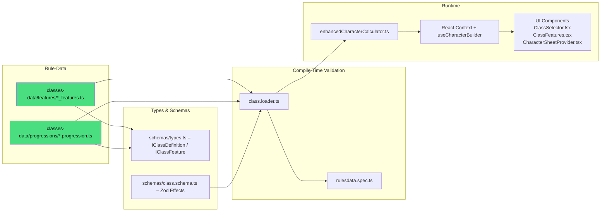

# DC20Clean – Class System (Vertical Slice)

> **Purpose**  
> This document is the _single authoritative reference_ (“bible”) for everything related to **Classes**, their **Features**, and **Level Progression**.  
> • Humans can follow the numbered guides & check-lists.  
> • AI agents can parse the 🗂 _File Maps_ and ⬢ _Mermaid_ graphs to discover dependencies.

---

## 1 High-Level Pipeline



---

## 2 Key Files & Their Roles

| Layer                     | File / Dir                                                                                | Responsibility                                                           |
| ------------------------- | ----------------------------------------------------------------------------------------- | ------------------------------------------------------------------------ |
| **Rule Data (canonical)** | `src/lib/rulesdata/classes-data/features/*_features.ts`                                   | Declarative definition of each class's core & subclass features          |
|                           | `src/lib/rulesdata/classes-data/progressions/*.progression.ts`                            | Level-by-level progression tables (HP, gains, features, etc.)            |
| **Type Contracts**        | `src/lib/rulesdata/schemas/types.ts`                                                      | TS interfaces `IClassDefinition`, `IClassFeature`, `IClassFeatureChoice` |
|                           | `src/lib/rulesdata/schemas/class.schema.ts`                                               | Zod schema used for validation & effect typing                           |
| **Validation Layer**      | `src/lib/rulesdata/loaders/class.loader.ts`                                               | Loads progression files and features, validates against schema           |
|                           | `src/lib/rulesdata/rulesdata.spec.ts`                                                     | Unit test that asserts every class passes the schema                     |
| **Runtime Engine**        | `src/lib/services/enhancedCharacterCalculator.ts`                                         | Aggregates class effects, resolves choices, outputs stats                |
| **State Layer**           | `src/lib/stores/characterContext.tsx`<br>`src/lib/hooks/useCharacterBuilder.ts`           | Provides calculated results to UI                                        |
| **UI**                    | `src/routes/character-creation/*` (selection)<br>`src/routes/character-sheet/*` (display) | Import `classesData` / `classFeaturesData` directly                      |

---

## 3 Adding **New Class** – Checklist ✅

1. **Data**  
   1.1 Create progression file: `classes-data/progressions/<class>.progression.ts`  
   ‑ Export `<class>Progression` array with level-by-level gains (HP, skills, features, talents, pathPoints, etc.).  
   1.2 Create feature file: `classes-data/features/<class>_features.ts` exporting `<class>Class` that conforms to `ClassDefinition`.  
   ‑ Include `coreFeatures`, `subclasses`, and any starting equipment blocks.  
   1.3 Add class metadata to `class.loader.ts` CLASS_METADATA constant.
2. **Names & IDs**  
   ‑ `className` (PascalCase) must match table file and UI strings.  
   ‑ Exported constant should follow the `<name>Class` pattern (e.g., `paladinClass`).
3. **Effects**  
   ‑ Re-use existing `effect.type` strings whenever possible (see `docs/systems/EFFECT_SYSTEM.MD`).  
   ‑ If a genuinely new mechanic is required, see §4 before merging.
4. **Types / Schema**  
   ‑ Add new `effect.type` to `class.schema.ts` **and** `types.ts` as needed.  
   ‑ Update any calculator logic (usually in `createStatBreakdown`).
5. **Calculator Support**  
   ‑ Numeric buffs → update stat aggregation helpers.  
   ‑ Abilities (actions, reactions) → emit as `GRANT_ABILITY` (no engine change).
6. **UI**  
   ‑ Components auto-render from data; images/icons may be added under `assets/` if desired.
7. **Tests**  
   ‑ Run `npm run test:unit`; `rulesdata.spec.ts` should pass.  
   ‑ Add dedicated calculation tests for complex mechanics.
8. **Docs**  
   ‑ Append a bullet to this file under “Next Classes Added”.
9. **Commit Message Template**
   ```
   feat(rules): add <ClassName> class & N core features
   - *_features.ts: +N entries
   - *.progression.ts: new file
   - tests: update counts
   ```

---

## 4 Adding **New Class Feature Effect Type** – Decision Matrix

| Question                                           | Yes                                                                 | No                                      |
| -------------------------------------------------- | ------------------------------------------------------------------- | --------------------------------------- |
| Does an existing `effect.type` cover the mechanic? | Use it → go to Step 3                                               | Create new type → continue              |
| Does the effect alter a **numeric stat**?          | Implement in calculator (`createStatBreakdown`)                     | Use `GRANT_ABILITY` + manual rules text |
| Does the UI need to resolve **user choice**?       | Add `userChoiceRequired` in feature & update `resolveEffectChoices` | —                                       |

**When a new type is created:**

1. Extend `IClassFeature.effects[].type` JSDoc comment (open list).
2. Extend Zod schema validation.
3. Implement logic in calculator.
4. Write unit test(s).

---

## 5 Troubleshooting FAQ 🤖

| Symptom                               | Likely Cause                                                                | Fix                                                |
| ------------------------------------- | --------------------------------------------------------------------------- | -------------------------------------------------- |
| **Vite import error** for class files | File path typo (`classes-data/...`)                                         | Check `import ... classFeaturesData` paths         |
| New class not visible in UI           | Missing `_features.ts` or `.progression.ts` file, or missing CLASS_METADATA | Verify file names, exported constant, and metadata |
| Unit test `rulesdata.spec.ts` fails   | Schema violation (missing field / wrong effect)                             | Inspect test output & update data                  |
| Stats not updating for new effect     | Effect type not handled in calculator                                       | Add case to `createStatBreakdown`                  |
| Feature choice dropdown empty         | `choices` array missing `options`                                           | Populate `options` with `label` & `value` fields   |

---

## 6 Future Evolution

-- Effect Processor integration will unify class & ancestry effect handling—update §3 Step 4 when landed.

- **Subclass-driven UI**: dynamic forms may auto-render based on schema.
- **Data-driven progression editor** planned; stay tuned.

---

## 7 DC20 v0.10 Notes

**Level Cap**: DC20 v0.10 is a level 1-10 system (not 1-20). All class progressions have 10 levels.

**Classes Available** (13 total):
- Martial: Barbarian, Champion, Commander, Hunter, Monk, Rogue
- Caster: Bard, Cleric, Druid, Sorcerer, Warlock, Wizard
- Hybrid: Spellblade

**Key Changes from v0.9.5**:
- Techniques have been removed entirely from the game
- Spell schools reorganized to 8 schools (Astromancy, Conjuration, Divination, Elemental, Enchantment, Invocation, Nullification, Transmutation)
- Spell lists removed; spells are accessed by source (Arcane/Divine/Primal) and school
- Class features updated with new effects and descriptions

---

> _Last updated: 2026-01-05_  
> Maintainer: @DC20Clean-Team
