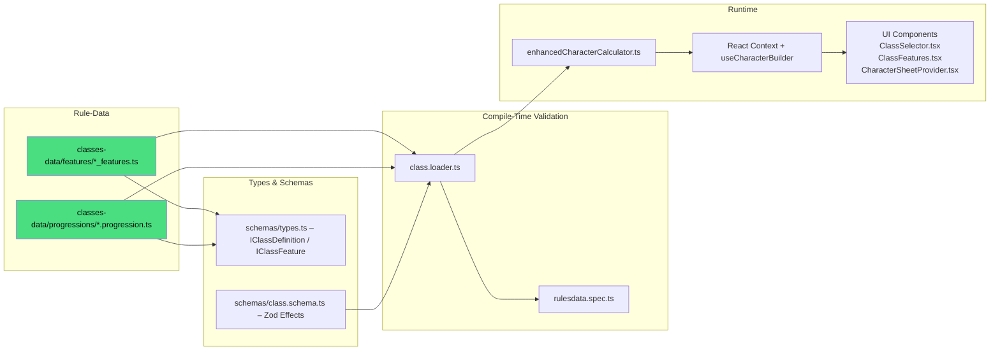

# DC20Clean – Class System

> Purpose: Single reference for Classes, Features, Talents, and Level Progression.
> Status: Active
> Last Updated: 2026-02-06

---

## 1 High-Level Pipeline



---

## 2 Key Files & Their Roles

| Layer | File / Dir | Responsibility |
| --- | --- | --- |
| **Features** | `classes-data/features/*_features.ts` (14 files) | Declarative definition of each class's core & subclass features |
| **Progressions** | `classes-data/progressions/*.progression.ts` (13 files) | Level-by-level progression tables (HP, gains, features, etc.) |
| **Progression Templates** | `classes-data/progressions/templates/` | Shared templates: `martial.template.ts` (Barbarian, Champion, Commander, Hunter, Monk), `caster.template.ts` (Bard, Cleric, Druid, Sorcerer, Warlock, Wizard), `spellblade.template.ts` (hybrid) |
| **Talents** | `classes-data/talents/*.talents.ts` (13 class files) | Per-class talent definitions with prerequisites and effects |
| **Talent Infrastructure** | `classes-data/talents/talent.types.ts` | `Talent` interface, `TalentCategory`, `TalentPrerequisites` |
| | `classes-data/talents/talent.loader.ts` | Loads and indexes talents by class |
| | `classes-data/talents/talents.data.ts` | Combined talent data export |
| **Progression Resolver** | `classes-data/classProgressionResolver.ts` | Resolves progression up to target level; returns budgets, features, choices |
| **Class Utilities** | `classes-data/classUtils.ts` | Helper functions for class/subclass data lookup |
| **Progression Types** | `classes-data/progressionTypes.ts` | `ClassProgressionGains`, `ClassProgressionLevel` interfaces |
| **Type Contracts** | `schemas/types.ts` | TS interfaces `IClassDefinition`, `IClassFeature`, `IClassFeatureChoice` |
| | `schemas/class.schema.ts` | Zod schema for validation & effect typing |
| **Validation** | `loaders/class.loader.ts` | Loads progression, features, `spellRestrictions`; validates against schema |
| | `rulesdata.spec.ts` | Unit test asserting every class passes schema |
| **Runtime** | `services/enhancedCharacterCalculator.ts` | Aggregates class effects, resolves choices, outputs stats |
| **State** | `stores/characterContext.tsx`, `hooks/useCharacterBuilder.ts` | Provides calculated results to UI |
| **UI** | `routes/character-creation/*` (selection), `routes/character-sheet/*` (display) | Imports `classesData` / `classFeaturesData` |

All paths above are relative to `src/lib/rulesdata/` unless otherwise noted.

---

## 3 Adding **New Class** – Checklist ✅

1. **Data**  
   1.1 Create progression file: `classes-data/progressions/<class>.progression.ts`  
   ‑ Export `<class>Progression` array with level-by-level gains (HP, skills, features, talents, pathPoints, etc.).  
   1.2 Create feature file: `classes-data/features/<class>_features.ts` exporting `<class>Class` that conforms to `ClassDefinition`.  
   ‑ Include `coreFeatures`, `subclasses`, and any starting equipment blocks.  
   1.3 Add class metadata to `class.loader.ts` CLASS_METADATA constant.
2. **Names & IDs**  
   ‑ `className` (PascalCase) must match table file and UI strings.  
   ‑ Exported constant should follow the `<name>Class` pattern (e.g., `paladinClass`).
3. **Effects**  
   ‑ Re-use existing `effect.type` strings whenever possible (see `docs/systems/EFFECT_SYSTEM.MD`).  
   ‑ If a genuinely new mechanic is required, see §4 before merging.
4. **Types / Schema**  
   ‑ Add new `effect.type` to `class.schema.ts` **and** `types.ts` as needed.  
   ‑ Update any calculator logic (usually in `createStatBreakdown`).
5. **Calculator Support**  
   ‑ Numeric buffs → update stat aggregation helpers.  
   ‑ Abilities (actions, reactions) → emit as `GRANT_ABILITY` (no engine change).
6. **UI**  
   ‑ Components auto-render from data; images/icons may be added under `assets/` if desired.
7. **Tests**  
   ‑ Run `npm run test:unit`; `rulesdata.spec.ts` should pass.  
   ‑ Add dedicated calculation tests for complex mechanics.
8. **Docs**  
   ‑ Append a bullet to this file under “Next Classes Added”.
9. **Commit Message Template**
   ```
   feat(rules): add <ClassName> class & N core features
   - *_features.ts: +N entries
   - *.progression.ts: new file
   - tests: update counts
   ```

---

## 4 Talent System

Talents are level-up choices that grant additional effects. They are defined per-class in `classes-data/talents/`.

### Talent Data Shape (`talent.types.ts`)

```typescript
type TalentCategory = 'General' | 'Class' | 'Multiclass';

interface TalentPrerequisites {
  level?: number;
  classId?: string;
  feature?: string;
  otherFeature?: string;
  subclass?: string;
  other?: string;
}

interface Talent {
  id: string;
  name: string;
  category: TalentCategory;
  description: string;
  effects: Effect[];
  prerequisites: TalentPrerequisites;
  stackable?: boolean;
}
```

### Talent Files

Each class has a `<class>.talents.ts` file (13 files) plus shared data in `talents.data.ts`. The `talent.loader.ts` loads and indexes them by class.

### Adding a New Talent

1. Add entry to the appropriate `<class>.talents.ts` file
2. Set `category` to `General`, `Class`, or `Multiclass`
3. Define `prerequisites` (level, classId, feature, subclass)
4. Define `effects` using existing effect types from `EFFECT_SYSTEM.MD`
5. Set `stackable: true` if the talent can be taken multiple times
6. Run `npm run test:unit` — talent tests in `talents.test.ts` should pass

---

## 5 Adding **New Class Feature Effect Type** – Decision Matrix

| Question                                           | Yes                                                                 | No                                      |
| -------------------------------------------------- | ------------------------------------------------------------------- | --------------------------------------- |
| Does an existing `effect.type` cover the mechanic? | Use it → go to Step 3                                               | Create new type → continue              |
| Does the effect alter a **numeric stat**?          | Implement in calculator (`createStatBreakdown`)                     | Use `GRANT_ABILITY` + manual rules text |
| Does the UI need to resolve **user choice**?       | Add `userChoiceRequired` in feature & update `resolveEffectChoices` | —                                       |

**When a new type is created:**

1. Extend `IClassFeature.effects[].type` JSDoc comment (open list).
2. Extend Zod schema validation.
3. Implement logic in calculator.
4. Write unit test(s).

---

## 6 Troubleshooting FAQ

| Symptom                               | Likely Cause                                                                | Fix                                                |
| ------------------------------------- | --------------------------------------------------------------------------- | -------------------------------------------------- |
| **Vite import error** for class files | File path typo (`classes-data/...`)                                         | Check `import ... classFeaturesData` paths         |
| New class not visible in UI           | Missing `_features.ts` or `.progression.ts` file, or missing CLASS_METADATA | Verify file names, exported constant, and metadata |
| Unit test `rulesdata.spec.ts` fails   | Schema violation (missing field / wrong effect)                             | Inspect test output & update data                  |
| Stats not updating for new effect     | Effect type not handled in calculator                                       | Add case to `createStatBreakdown`                  |
| Feature choice dropdown empty         | `choices` array missing `options`                                           | Populate `options` with `label` & `value` fields   |

---

## 7 Future Evolution

-- Effect Processor integration will unify class & ancestry effect handling—update §3 Step 4 when landed.

- **Subclass-driven UI**: dynamic forms may auto-render based on schema.
- **Data-driven progression editor** planned; stay tuned.

---

## 8 DC20 v0.10 Notes

**Level Cap**: DC20 v0.10 is a level 1-10 system (not 1-20). All class progressions have 10 levels.

**Classes Available** (14 feature files; Psion is data-only/incomplete):

- Martial: Barbarian, Champion, Commander, Hunter, Monk, Rogue
- Caster: Bard, Cleric, Druid, Psion, Sorcerer, Warlock, Wizard
- Hybrid: Spellblade

**Key Changes from v0.9.5**:

- Techniques have been removed entirely from the game
- Spell schools reorganized to 8 schools (Astromancy, Conjuration, Divination, Elemental, Enchantment, Invocation, Nullification, Transmutation)
- Spell lists removed; spells are accessed by source (Arcane/Divine/Primal) and school
- Class features updated with new effects and descriptions
- **Slot-Based Spell System (M3.20)**: Classes now define individual spell/cantrip slots ("Pockets"), supporting highly specific restrictions (e.g., expanded schools) alongside broad global magic profiles.
- **Data-Driven Spell Restrictions**: Classes now define `spellRestrictions` (allowed sources, schools, and tags) to automatically filter available spells in the character creator.

**Recent Updates (2026-02-06)**:

- **Starting Equipment**: Arsenal changed from "Choose 2" to "Choose 3" for martial classes. Trade Tools selection added to all classes.
- **Progression Feature IDs**: Fixed 12 broken feature ID references across Commander, Monk, Sorcerer, Warlock, Druid, Hunter, and Spellblade progressions.
- **Subclass Features**: Added missing subclass feature IDs to Commander, Bard, and Cleric.
- **Sorcerer Subclasses**: Corrected 4 subclass feature `levelGained` values from level 1 to level 3 (Celestial Spark, Celestial Appearance, Draconic Spark, Draconic Appearance).

---

> _Last updated: 2026-02-06_  
> Maintainer: @DC20Clean-Team
