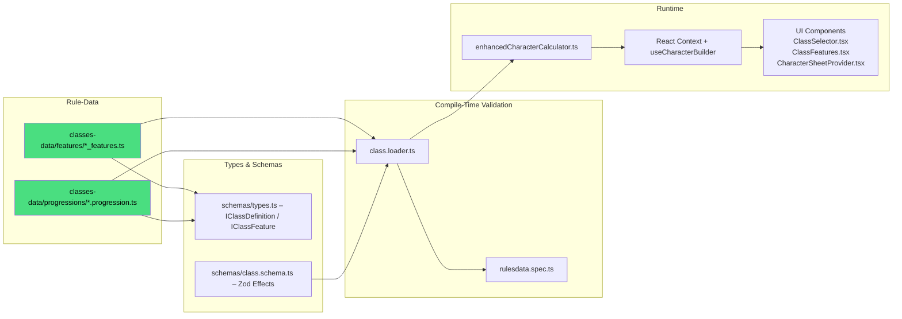

# DC20Clean – Class System

> Purpose: Single reference for Classes, Features, Talents, and Level Progression.
> Status: Active
> Last Updated: 2026-06-24

---

## 1 High-Level Pipeline


```mermaid
flowchart LR
    subgraph Rule-Data
        A1[classes-data/features/*_features.ts]
        A2[classes-data/progressions/*.progression.ts]
        style A1 fill:#4ade80,color:#000
        style A2 fill:#4ade80,color:#000
    end

    subgraph Types & Schemas
        B1[schemas/types.ts – IClassDefinition / IClassFeature]
        B2[schemas/class.schema.ts – Zod Effects]
    end

    A1 --> B1
    A2 --> B1

    subgraph Compile-Time Validation
        C1[class.loader.ts]
        C2[rulesdata.spec.ts]
    end

    A1 & A2 --> C1
    B2 --> C1
    C1 --> C2

    subgraph Runtime
        D1[enhancedCharacterCalculator.ts]
        D2[React Context + useCharacterBuilder]
        D3[UI Components<br/>ClassSelector.tsx<br/>ClassFeatures.tsx<br/>CharacterSheetProvider.tsx]
    end

    C1 --> D1 --> D2 --> D3
```

---

## 2 Key Files & Their Roles

| Layer                     | File / Dir                                                                      | Responsibility                                                                                                                                                              |
| ------------------------- | ------------------------------------------------------------------------------- | --------------------------------------------------------------------------------------------------------------------------------------------------------------------------- |
| **Features**              | `classes-data/features/*_features.ts` (13 files)                                | Declarative definition of each class's core & subclass features                                                                                                             |
| **Progressions**          | `classes-data/progressions/classProgressionDefinitions.ts`                      | Central runtime progression model: each class declares `fullMartial`, `fullCaster`, or `hybrid`, plus feature schedule and optional full explicit source table              |
|                           | `classes-data/progressions/*.progression.ts` (13 files)                         | Thin public exports that resolve the class table from `classProgressionDefinitions.ts`                                                                                      |
| **Progression Templates** | `classes-data/progressions/templates/`                                          | Shared source-of-truth category tables: `martial.template.ts`, `caster.template.ts`, `spellblade.template.ts`, plus `createClassProgression()` for feature schedule overlay |
| **Talents**               | `classes-data/talents/*.talents.ts` (13 class files)                            | Per-class talent definitions with prerequisites and effects                                                                                                                 |
| **Talent Infrastructure** | `classes-data/talents/talent.types.ts`                                          | `Talent` interface, `TalentCategory`, `TalentPrerequisites`                                                                                                                 |
|                           | `classes-data/talents/talent.loader.ts`                                         | Loads and indexes talents by class                                                                                                                                          |
|                           | `classes-data/talents/talents.data.ts`                                          | Combined talent data export                                                                                                                                                 |
| **Progression Resolver**  | `classes-data/classProgressionResolver.ts`                                      | Resolves progression up to target level; returns budgets, features, choices                                                                                                 |
| **Class Utilities**       | `classes-data/classUtils.ts`                                                    | Helper functions for class/subclass data lookup                                                                                                                             |
| **Progression Types**     | `classes-data/progressionTypes.ts`                                              | `ClassProgressionGains`, `ClassProgressionLevel` interfaces                                                                                                                 |
| **Type Contracts**        | `schemas/types.ts`                                                              | TS interfaces `IClassDefinition`, `IClassFeature`, `IClassFeatureChoice`                                                                                                    |
|                           | `schemas/class.schema.ts`                                                       | Zod schema for validation & effect typing                                                                                                                                   |
| **Validation**            | `loaders/class.loader.ts`                                                       | Loads progression, features, `spellRestrictions`; validates against schema                                                                                                  |
|                           | `rulesdata.spec.ts`                                                             | Unit test asserting every class passes schema                                                                                                                               |
| **v0.10.5 Audit**         | `scripts/classes/dc20-0105-classes.mjs`                                         | Extracts the class source report from `docs/assets/dc20-0.10.5/DC20 0.10.5 clean.md`                                                                                        |
|                           | `scripts/classes/dc20-0105-class-effects.ts`                                    | Classifies runtime class feature effects against calculator/stat/display paths                                                                                              |
|                           | `scripts/classes/dc20-0105-class-audit-report.mjs`                              | Generates the human-readable class feature audit markdown                                                                                                                   |
|                           | `docs/migration/classes-v0105-report.json`                                      | Generated source comparison report for core classes                                                                                                                         |
|                           | `docs/migration/class-feature-effect-classification.json`                       | Generated implementation coverage report for runtime class feature effects                                                                                                  |
|                           | `docs/migration/class-feature-audit.md`                                         | Human-readable per-class report covering features, selections, and effects                                                                                                  |
|                           | `classes-data/classesSource.test.ts`                                            | Focused source/runtime/effect report validation                                                                                                                             |
| **Runtime**               | `services/enhancedCharacterCalculator.ts`                                       | Aggregates class effects, resolves choices, outputs stats                                                                                                                   |
| **State**                 | `stores/characterContext.tsx`, `hooks/useCharacterBuilder.ts`                   | Provides calculated results to UI                                                                                                                                           |
| **UI**                    | `routes/character-creation/*` (selection), `routes/character-sheet/*` (display) | Imports `classesData` / `classFeaturesData`                                                                                                                                 |

All paths above are relative to `src/lib/rulesdata/` unless otherwise noted.

---

## 3 Adding **New Class** – Checklist ✅

1. **Data**  
   1.1 Add an entry to `classes-data/progressions/classProgressionDefinitions.ts`.
   ‑ Set `category` to `fullMartial`, `fullCaster`, or `hybrid`.
   ‑ Add class-specific feature IDs in `featureSchedule`, normally levels 1, 2, 5, and 9.
   ‑ Provide `explicitProgression` only when the source publishes a class table that differs from the category table. Explicit progression must be a full 10-row table, not a partial patch.
   1.2 Create progression file: `classes-data/progressions/<class>.progression.ts`.
   ‑ Export `<class>Progression` by calling `resolveClassProgressionTable('<classId>')`.
   1.3 Create feature file: `classes-data/features/<class>_features.ts` exporting `<class>Class` that conforms to `ClassDefinition`.
   ‑ Include `coreFeatures`, `subclasses`, and any starting equipment blocks.  
   1.4 Add class metadata to `class.loader.ts` CLASS_METADATA constant.
2. **Names & IDs**  
   ‑ `className` (PascalCase) must match table file and UI strings.  
   ‑ Exported constant should follow the `<name>Class` pattern (e.g., `paladinClass`).
3. **Effects**  
   ‑ Re-use existing `effect.type` strings whenever possible (see `docs/systems/EFFECT_SYSTEM.MD`).  
   ‑ If a genuinely new mechanic is required, see §4 before merging.
4. **Types / Schema**  
   ‑ Add new `effect.type` to `class.schema.ts` **and** `types.ts` as needed.  
   ‑ Update any calculator logic (usually in `createStatBreakdown`).
5. **Calculator Support**  
   ‑ Numeric buffs → update stat aggregation helpers.  
   ‑ Abilities (actions, reactions) → emit as `GRANT_ABILITY` (no engine change).
6. **UI**  
   ‑ Components auto-render from data; images/icons may be added under `assets/` if desired.
7. **Tests**  
   ‑ Run `npm run test:unit`; `rulesdata.spec.ts` should pass.  
   ‑ Add dedicated calculation tests for complex mechanics.
8. **Docs**  
   ‑ Append a bullet to this file under “Next Classes Added”.
9. **Commit Message Template**
   ```
   feat(rules): add <ClassName> class & N core features
   - *_features.ts: +N entries
   - *.progression.ts: new file
   - tests: update counts
   ```

---

## 4 Talent System

Talents are level-up choices that grant additional effects. They are defined per-class in `classes-data/talents/`.

### Talent Data Shape (`talent.types.ts`)

```typescript
type TalentCategory = 'General' | 'Class' | 'Multiclass';

interface TalentPrerequisites {
	level?: number;
	classId?: string;
	feature?: string;
	otherFeature?: string;
	subclass?: string;
	other?: string;
}

interface Talent {
	id: string;
	name: string;
	category: TalentCategory;
	description: string;
	effects: Effect[];
	prerequisites: TalentPrerequisites;
	stackable?: boolean;
}
```

### Talent Files

Each class has a `<class>.talents.ts` file (13 files) plus shared data in `talents.data.ts`. The `talent.loader.ts` loads and indexes them by class.

### Adding a New Talent

1. Add entry to the appropriate `<class>.talents.ts` file
2. Set `category` to `General`, `Class`, or `Multiclass`
3. Define `prerequisites` (level, classId, feature, subclass)
4. Define `effects` using existing effect types from `EFFECT_SYSTEM.MD`
5. Set `stackable: true` if the talent can be taken multiple times
6. Run `npm run test:unit` — talent tests in `talents.test.ts` should pass

---

## 5 Adding **New Class Feature Effect Type** – Decision Matrix

| Question                                           | Yes                                                                 | No                                      |
| -------------------------------------------------- | ------------------------------------------------------------------- | --------------------------------------- |
| Does an existing `effect.type` cover the mechanic? | Use it → go to Step 3                                               | Create new type → continue              |
| Does the effect alter a **numeric stat**?          | Implement in calculator (`createStatBreakdown`)                     | Use `GRANT_ABILITY` + manual rules text |
| Does the UI need to resolve **user choice**?       | Add `userChoiceRequired` in feature & update `resolveEffectChoices` | —                                       |

**When a new type is created:**

1. Extend `IClassFeature.effects[].type` JSDoc comment (open list).
2. Extend Zod schema validation.
3. Implement logic in calculator.
4. Write unit test(s).

---

## 6 Troubleshooting FAQ

| Symptom                               | Likely Cause                                                                | Fix                                                |
| ------------------------------------- | --------------------------------------------------------------------------- | -------------------------------------------------- |
| **Vite import error** for class files | File path typo (`classes-data/...`)                                         | Check `import ... classFeaturesData` paths         |
| New class not visible in UI           | Missing `_features.ts` or `.progression.ts` file, or missing CLASS_METADATA | Verify file names, exported constant, and metadata |
| Unit test `rulesdata.spec.ts` fails   | Schema violation (missing field / wrong effect)                             | Inspect test output & update data                  |
| Stats not updating for new effect     | Effect type not handled in calculator                                       | Add case to `createStatBreakdown`                  |
| Feature choice dropdown empty         | `choices` array missing `options`                                           | Populate `options` with `label` & `value` fields   |

---

## 7 Future Evolution

-- Effect Processor integration will unify class & ancestry effect handling—update §3 Step 4 when landed.

- **Subclass-driven UI**: dynamic forms may auto-render based on schema.
- **Data-driven progression editor** planned; stay tuned.

---

## 8 DC20 v0.10.5 Notes

**Level Cap**: DC20 v0.10.5 is a level 1-10 system (not 1-20). All class progressions have 10 levels.

**Classes Available** (13 feature files):

- Martial: Barbarian, Champion, Commander, Hunter, Monk, Rogue
- Caster: Bard, Cleric, Druid, Sorcerer, Warlock, Wizard
- Hybrid: Spellblade

**Key v0.10.5 Progression Contract**:

- Martial starting resources: 2 SP at level 1.
- Spellcaster starting resources: 6 MP at level 1, with +3 MP at levels 3, 5, 7, 9, and 10.
- Hybrid starting resources: Spellblade starts with 1 SP and 3 MP, then totals 3 SP and 11 MP by level 10.
- Runtime derives numeric resources, talent/path/ancestry timing, and subclass-choice timing from the class's progression category unless the class has a full explicit source progression table.
- Per-class progression files are stubs over `resolveClassProgressionTable('<classId>')`.
- Current explicit progression tables: Rogue and Warlock. Both differ from their category defaults in HP gains.
- Category-derived classes provide only the feature IDs that occupy the class-feature slots.
- Talent grants are not class features. Keep `gains.talents` in the shared progression templates and do not add generic `Talent` feature records to `classes-data/features/*_features.ts`.
- Shared feature schedule:
  - Level 1: Class Features
  - Level 2: Class Feature, Talent, Path Progression
  - Level 3: Subclass Feature
  - Level 4: Talent, 2 Ancestry Points, Path Progression
  - Level 5: Class Expert Feature
  - Level 6: Talent, Path Progression
  - Level 7: Subclass Expert Feature
  - Level 8: Talent, 2 Ancestry Points, Path Progression
  - Level 9: Class Capstone Feature
  - Level 10: Subclass Capstone Feature

**Level 5 Expert Feature Contract**:

- Every implemented v0.10.5 class resolves a level 5 Expert Feature from the existing persisted ID shape (`<class>_level_5_placeholder`).
- Those IDs are intentionally retained as compatibility aliases for saved v0.10 characters and progression references; only the displayed feature name, description, benefits, and modeled effects changed.
- Universal mechanical benefits use existing effect types (`MODIFY_STAT`, `GRANT_SPELL`, `GRANT_MANEUVERS`, `GRANT_ABILITY`) so character creation, sheet rendering, calculator breakdowns, and PDF export consume the same data path.

**Level 9 Class Capstone Contract**:

- The bundled v0.10.5 source tables schedule a Class Capstone Feature at level 9, but do not publish class-specific capstone mechanics.
- Runtime class data does not include source-unpublished capstone placeholders.
- Do not invent class capstone mechanics from names, table labels, or older placeholder text. Add level 9 class capstones only when a source publishes mechanics.

**v0.10.5 Audit Path**:

```bash
npm run classes:generate:0105
npm run classes:effects:generate
npm run classes:audit:generate
npm run classes:validate:0105
npm run classes:effects:validate
npm run classes:audit:validate
npm run test:unit -- --project server --run src/lib/rulesdata/classes-data/classesSource.test.ts
```

- `docs/migration/classes-v0105-report.json` is the source-derived class report: core class list, detailed class tables, starting equipment, paths, subclass choices, and broad `coreFeatureCandidates`.
- `docs/migration/class-feature-effect-classification.json` is the runtime implementation coverage report for class feature effects.
- `docs/migration/class-feature-audit.md` is the readable report grouped alphabetically by class, then feature, selection, and effect.
- The class audit fails focused tests when any feature has duplicate always-on effects across direct feature effects and benefit effects. Choice-option effects are excluded from this duplicate check.
- Runtime exposes 13 core class feature definitions: Barbarian, Bard, Champion, Cleric, Commander, Druid, Hunter, Monk, Rogue, Sorcerer, Spellblade, Warlock, Wizard.
- The clean v0.10.5 source has detailed class chapters for 12 of those runtime classes. Cleric is listed as core but has no detailed class chapter in the parsed class source range.
- Source feature extraction uses broad candidates because the cleaned markdown uses flat `##` headings for both real feature names and nested option headings. Runtime validation matches implemented L1/L2/L5 non-placeholder features against those candidates.
- Effect coverage categories are `calculated`, `collected`, `choice-tracked`, `progression-derived`, `partial`, and `uncovered`. `calculated` feeds numeric/stat/resource/spell/maneuver output; `collected` means the sheet/calculator gathers the effect for display/use. `text-only-no-effects` and `flavor-no-effects` are failing audit states: non-progression class features need at least one structured effect, even if that effect is only a collected rules note.
- Combat Training from class paths uses canonical effect targets from the source audit: `Weapons`, `Spell_Focuses`, `Light_Armor`, `Heavy_Armor`, `All_Armor`, `Light_Shields`, `Heavy_Shields`, and `All_Shields`. Focused resolver tests compare every class against the v0.10.5 source list.

**Champion Fighting Spirit Contract**:

- v0.10.5 renames the Champion Fighting Spirit option `Brace` to `Fortify` to avoid confusion with the still-current Brace maneuver.
- `Advance` now grants ADV on the next Martial Attack or Physical Check.
- The rulesdata effect target is `combat_readiness_fortify`; legacy references to `combat_readiness_brace` are treated as a feature alias, not a maneuver alias.

**Removed Talent Contract**:

- `Swift Berserker` is removed from v0.10.5 selection and marked deprecated in `barbarian.talents.ts`.
- Deprecated talents remain in `allTalents` and `findTalentById()` so old saved characters can still load, render, calculate existing effects, and export.
- Character creation uses `selectableTalents`, which filters deprecated talents out of new or level-up choices.

**Key Changes from v0.9.5/v0.10**:

- Techniques have been removed entirely from the game
- Spell schools reorganized to 8 schools (Astromancy, Conjuration, Divination, Elemental, Enchantment, Invocation, Nullification, Transmutation)
- Spell lists removed; spells are accessed by source (Arcane/Divine/Primal) and school
- Class features updated with new effects and descriptions
- **Slot-Based Spell System (M3.20)**: Classes now define individual spell/cantrip slots ("Pockets"), supporting highly specific restrictions (e.g., expanded schools) alongside broad global magic profiles.
- **Data-Driven Spell Restrictions**: Classes now define `spellRestrictions` (allowed sources, schools, and tags) to automatically filter available spells in the character creator.

**Recent Updates (2026-06-01)**:

- **Level 5 Expert Features**: Replaced all level 5 class placeholders with explicit v0.10.5 Expert Feature blocks while preserving the legacy placeholder IDs for saved-character compatibility.
- **v0.10.5 Progression Tables**: Updated caster MP gains, Spellblade starting/capstone MP, and levels 6-10 feature/talent/path/ancestry schedule.
- **Champion Fighting Spirit**: Updated Combat Readiness to use `Fortify` and Advance's Martial Attack / Physical Check wording while preserving the Brace maneuver as a separate current maneuver.
- **Feature Semantics Pass**: Updated Elemental Blast, Cleric, Commander, Monk, Rogue, and Spellblade feature text/effects to the source-confirmed v0.10.5 behavior while preserving existing feature IDs.
- **Swift Berserker Removal**: Deprecated Swift Berserker for compatibility lookup while hiding it from current character creation selections.
- **Path Progression Display**: `class.loader.ts` now surfaces `pathProgression: true` as "Path Progression" in formatted level rows.
- **Progression Tests**: Added v0.10.5 resolver coverage for caster/hybrid MP totals, level 6-10 schedule, and level 5 Expert Feature coverage/effects.

**Recent Updates (2026-06-13)**:

- **Starting Equipment Migration**: Canonical class data now stores v0.10.5 starting equipment in structured `startingEquipment` blocks using `arsenal`, `spellFocuses`, `armor`, `tradeTools`, and `packs`, with conditional Heavy Armor/Heavy Shield language preserved where the source ties it to specific level-1 feature choices.
- **Class Spell/Training Grants**: Exact spell grants now resolve to canonical generated spell IDs, unresolved class spell choices no longer create unrestricted slots, Wizard/Sorcerer/Warlock/Druid grant `Spell_Focuses` training, and Cleric Chastise / Hand of Salvation render as granted abilities.
- **Intro Flavor Guard**: Monk, Rogue, and Spellblade `Source of Power` flavor entries are excluded from automatic multiclass flavor-feature grants.
- **Level 9 Capstone Source Gap**: Source-unpublished class capstone placeholders were removed. Level 9 class capstones should be added only when class-specific source mechanics exist.

**Recent Updates (2026-06-22)**:

- **Duplicate Always-On Effect Audit**: Class feature audit reports and tests now flag duplicate always-on effects across direct feature effects and benefit effects. Barbarian Martial Path combat training now lives only under its `Combat Training` benefit, removing duplicate Weapons/Armor/Shields grants from runtime combat-training output.
- **Barbarian Runtime Effects**: Rage sheet toggles now feed the calculator `while_raging` condition. Berserker Defense applies from the inferred `not_wearing_armor` condition when no equipped armor row exists. Mighty Leap's `SET_VALUE:jumpCalculationAttribute=might` is calculator-backed and uses the higher of Might or Agility for Jump Distance.
- **Rage Attack Damage TODO**: Rage's `martial_melee_damage` effect remains an attack-row presentation TODO because the current sheet attack rows do not safely encode Unarmed Strike vs melee weapon vs ranged weapon.
- **Talent Feature Cleanup**: Generic level-2 `Talent` pseudo-features were removed from class feature data. Talent budgets now come only from shared progression template `gains.talents`, and level-up selection still consumes `selectedTalents`.
- **Combat Training Source Alignment**: Bard, Monk, Rogue, Champion, and conditional Cleric/Spellblade training are covered by source-aligned `GRANT_COMBAT_TRAINING` tests. Monk/Rogue now expose their missing Martial Path feature records, and Champion uses canonical `All_Armor`.
- **Martial Path Maneuver Source**: Martial Path maneuver access, including learning all Attack Maneuvers, is represented by class path/progression data (`martialPath.maneuvers`) rather than direct class feature effects. Commander and Hunter Martial Path feature effects now only collect combat training plus class-specific stamina regen where present.
- **Commander Natural Leader**: Natural Leader stores the full v0.10.5 source text and models its check-ADV clauses with `GRANT_ADV_ON_CHECK`; the calculator collects these as sheet-facing advantage notes rather than applying automatic roll math.
- **No Text-Only Feature Contract**: Class features should not remain prose-only. Descriptive or in-game-only mechanics use collected effects such as `GRANT_ABILITY` or `GRANT_ADV_ON_CHECK`; choice options should carry selected-option note effects when they have no calculator-backed mechanic. `classesSource.test.ts` fails if `text-only-no-effects` or `flavor-no-effects` reappears in the generated class effect report.
- **Cleric Domain Effects**: Knowledge now raises the five Knowledge Trade mastery caps through `INCREASE_TRADE_MASTERY_CAP`; Darkvision is range-aware and handles "10 Spaces, or +5 if already present"; Divination uses condition immunity for Flanked; nonnumeric domains are collected as granted abilities.
- **Hunter Subterranean Senses**: Subterranean Favored Terrain uses the same range-aware sense pattern as Cleric Dark Domain: Darkvision grants 10 or increases existing Darkvision by 5, and Tremorsense grants 3 or increases existing Tremorsense by 2.
- **Monk Stance TODO**: Monk Stances are currently selected text with no active sheet model. A future character-sheet benefits surface should expose the selected stance benefits and support active-state presentation for nuanced effects such as stance damage bonuses, ADV notes, movement changes, and reductions. This same benefits surface should also expose nuanced Rage benefits such as ADV on Athletics.
- **Spellblade Progression-Derived Paths**: Spellblade Martial Path and Spellcasting Path feature records are marked `isProgressionDerived` and carry no duplicate feature effects. The hybrid progression grants both martial and spellcasting table benefits; the class-specific stamina regen remains on `martialPath.staminaRegen` as collected in-game text.
- **Warlock Pact Armor MDR**: Pact Armor now grants binary MDR through `GRANT_RESISTANCE:mystical=true` instead of unsupported `MODIFY_STAT:mdr`.

**Recent Updates (2026-02-06)**:

- **Starting Equipment**: Arsenal changed from "Choose 2" to "Choose 3" for martial classes. Trade Tools selection added to all classes.
- **Progression Feature IDs**: Fixed 12 broken feature ID references across Commander, Monk, Sorcerer, Warlock, Druid, Hunter, and Spellblade progressions.
- **Subclass Features**: Added missing subclass feature IDs to Commander, Bard, and Cleric.
- **Sorcerer Subclasses**: Corrected 4 subclass feature `levelGained` values from level 1 to level 3 (Celestial Spark, Celestial Appearance, Draconic Spark, Draconic Appearance).

---

> _Last updated: 2026-06-23_
> Maintainer: @DC20Clean-Team
