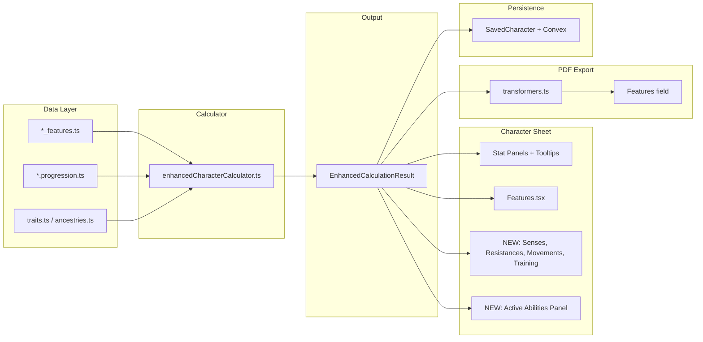
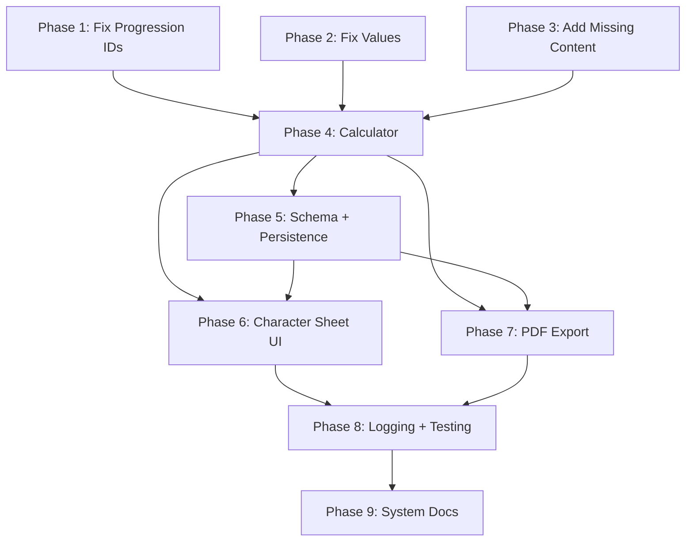

# DC20 Feature Validation — Implementation Plan

> **Status**: Pending  
> **Created**: 2026-02-06  
> **Last Updated**: 2026-02-06  
> **Archive**: When all phases are complete, move this file to `docs/archive/FEATURE_VALIDATION_PLAN.MD` and update this header to `Status: Completed — Archived YYYY-MM-DD`.

## Scope

84+ discrepancies across 13 classes and 11 ancestries, plus 6 major UI/calculator coverage gaps. This plan fixes data, wires the effect pipeline end-to-end, updates the character sheet and PDF export, handles schema changes, and adds tests.

## Supporting Artifacts

- [Validation Report](../assets/mapping/feature-validation-report.md) — all 84+ discrepancies
- [Feature Classification Map](../assets/mapping/feature-classification-map.md) — crunch/fluff mapping + UI coverage
- [DC20 0.10 Rules](../assets/DC20%200.10%20full.md) — source of truth

## Phase Tracker

| Phase | Description | Status |
|-------|-------------|--------|
| 1 | Fix 12 broken progression feature ID references + 4 Sorcerer subclass levelGained values | Complete |
| 2 | Fix incorrect values — Warlock MP, Halfling conditions, trait costs | Pending |
| 3a | Add missing subclass feature IDs to Commander, Bard, Cleric (12 features) | Pending |
| 3b | Add 5 missing Beastborn traits + wire Winged Arms to requirements.hasTrait + update validation | Pending |
| 3c | Fix starting equipment across all 13 classes (arsenal count + trade tools) | Pending |
| 3d | Fix description drift (Monk stance, Rogue duration/round, Spellblade runes, Dwarf description) | Pending |
| 4a | Refactor calculator into 8 discrete modules | Pending |
| 4b | Wire calculator to collect GRANT_RESISTANCE, GRANT_VULNERABILITY, GRANT_SENSE, GRANT_COMBAT_TRAINING + default Climb/Swim | Pending |
| 5 | Add optional fields to SavedCharacter + Convex schema, bump version to 2.2.0, add migration defaults | Pending |
| 6 | Character sheet — Movements panel, Senses, Resistances, Combat Training, Conditions, Features grouping | Pending |
| 7 | Update PDF features field to include Resistances, Senses, Combat Training sections | Pending |
| 8 | Add tests — snapshot, data validation, calculator collection, PDF formatting, E2E | Pending |
| 9 | Update system docs — 8 specs affected | Pending |

## Architecture Overview



---

## Phase 1: Fix Critical Data (P0 — Runtime Failures)

**Goal**: Fix progression files that reference non-existent feature IDs. These cause features to silently not resolve.

### 1a. Fix Progression ID Mismatches

8 broken references across 6 classes. For each, either fix the progression ID or add the missing feature.

| Class      | Progression References          | Feature File Has            | Fix                                                                   |
| ---------- | ------------------------------- | --------------------------- | --------------------------------------------------------------------- |
| Commander  | `commander_call`                | `commander_commanders_call` | Fix progression to `commander_commanders_call`                        |
| Monk       | `monk_inner_peace`              | Does not exist              | Determine correct feature ID from `monk_features.ts`, fix progression |
| Monk       | `monk_martial_arts`             | Does not exist              | Determine correct feature ID from `monk_features.ts`, fix progression |
| Sorcerer   | `sorcerer_spellcasting_path`    | Does not exist              | Add feature or fix ID                                                 |
| Sorcerer   | `sorcerer_magical_nature`       | Does not exist              | Map to `sorcerer_innate_power` or similar                             |
| Sorcerer   | `sorcerer_magical_overflow`     | Does not exist              | Map to `sorcerer_overload_magic` or similar                           |
| Warlock    | `warlock_spellcasting_path`     | Does not exist              | Add feature or fix ID                                                 |
| Warlock    | `warlock_occult_knowledge`      | Does not exist              | Add `warlock_beseech_patron` feature (rules: "Beseech Patron")        |
| Spellblade | `spellblade_spellcasting_path`  | Does not exist              | Add feature or fix ID                                                 |
| Spellblade | `spellblade_martial_path`       | Does not exist              | Add feature or fix ID                                                 |
| Druid      | `druid_animal_whisperer`        | `druid_wild_speech`         | Fix progression to `druid_wild_speech`                                |
| Hunter     | Missing `hunter_bestiary` in L1 | Feature exists              | Add `hunter_bestiary` to L1 classFeatures array                       |

**Files**:

- `src/lib/rulesdata/classes-data/progressions/commander.progression.ts`
- `src/lib/rulesdata/classes-data/progressions/monk.progression.ts`
- `src/lib/rulesdata/classes-data/progressions/sorcerer.progression.ts`
- `src/lib/rulesdata/classes-data/progressions/warlock.progression.ts`
- `src/lib/rulesdata/classes-data/progressions/spellblade.progression.ts`
- `src/lib/rulesdata/classes-data/progressions/druid.progression.ts`
- `src/lib/rulesdata/classes-data/progressions/hunter.progression.ts`
- Possibly feature files if new features need to be created

### 1b. Fix Incorrect levelGained

| Class    | Feature              | Current | Correct |
| -------- | -------------------- | ------- | ------- |
| Sorcerer | Celestial Spark      | 1       | 3       |
| Sorcerer | Celestial Appearance | 1       | 3       |
| Sorcerer | Draconic Spark       | 1       | 3       |
| Sorcerer | Draconic Appearance  | 1       | 3       |

**File**: `src/lib/rulesdata/classes-data/features/sorcerer_features.ts`

---

## Phase 2: Fix Incorrect Values (P1 — Wrong Behavior)

**Goal**: Fix values/conditions in feature and trait data that don't match rules.

### 2a. Class Feature Fixes

| Class      | Feature                      | Issue                 | Fix                                        |
| ---------- | ---------------------------- | --------------------- | ------------------------------------------ |
| Warlock    | Eldritch Forbidden Knowledge | MP reduction 1        | Change to 2                                |
| Warlock    | Pact Boon                    | Says "Cantrip" option | Change to "Spell"                          |
| Warlock    | Fey subclass                 | Missing Dream Walker  | Add flavor feature                         |
| Warlock    | Beseech Patron               | Missing               | Add flavor feature                         |
| Spellblade | Frost Rune                   | "Grappled by ice"     | Change to "Immobilized for 1 Round"        |
| Spellblade | Water Rune                   | "spend 1 AP" optional | Change to automatic Physical Save on Smite |

**Files**:

- `src/lib/rulesdata/classes-data/features/warlock_features.ts`
- `src/lib/rulesdata/classes-data/features/spellblade_features.ts`

### 2b. Ancestry Trait Fixes

| Ancestry   | Trait                   | Issue                  | Fix                                                             |
| ---------- | ----------------------- | ---------------------- | --------------------------------------------------------------- |
| Halfling   | Halfling Bravery        | "Rattled"              | Change to "Terrified"                                           |
| Halfling   | Burst of Bravery        | "Rattled"              | Change to "Terrified"                                           |
| Beastborn  | Tough                   | +2 HP                  | Change to +1 HP                                                 |
| Beastborn  | Venomous Natural Weapon | "Poisoned"             | Change to "Impaired"                                            |
| Elf        | Plant Knowledge         | cost: 0                | Change to 1                                                     |
| Dwarf      | Earthen Knowledge       | cost: 0, "underground" | Change cost to 1, description to "mountainous and subterranean" |
| Dragonborn | Second Breath           | cost: 1                | Change to 2                                                     |
| Angelborn  | Healing Touch           | failure restores 2 HP  | Change to 1 HP                                                  |
| Beastborn  | Web Walk                | cost: 0                | Change to 1                                                     |

**File**: `src/lib/rulesdata/ancestries/traits.ts`

---

## Phase 3: Add Missing Content (P2)

### 3a. Add Missing Subclass Feature IDs

12 subclass features across Commander, Bard, Cleric are missing `id` fields. Add them following the naming convention `{class}_{subclass}_{feature_slug}`.

**Files**:

- `src/lib/rulesdata/classes-data/features/commander_features.ts`
- `src/lib/rulesdata/classes-data/features/bard_features.ts`
- `src/lib/rulesdata/classes-data/features/cleric_features.ts`

### 3b. Add Missing Beastborn Traits

5 traits from rules not in code:

1. `beastborn_beastkind` (Cost: 0) — default auto-grant
2. `beastborn_strong_jumper` (Cost: 1) — Jumping
3. `beastborn_stealth_feathers` (Cost: 2) — Flying, requires Limited Flight
4. `beastborn_shell_retreat` (Cost: 1) — Body, requires Hard Shell
5. `beastborn_shoot_webs` (Cost: 2) — Miscellaneous

### 3b-ii. Wire Winged Arms to `requirements.hasTrait`

The `TraitRequirements` interface already exists in `character.schema.ts` with `hasTrait?: string[]` (any-of semantics). Currently unused — validation only checks the deprecated `prerequisites` array.

**Data change** in `traits.ts`:

```typescript
// Remove: prerequisites: ['beastborn_limited_flight']
// Add:
requirements: {
  hasTrait: ['beastborn_glide_speed', 'beastborn_limited_flight', 'beastborn_full_flight', 'beastborn_flyby']
}
```

**Validation change** in `SelectedAncestries.tsx` — update `arePrerequisitesMet()`:

- Check `trait.requirements` first (supersedes deprecated `prerequisites`)
- `requirements.hasTrait` uses `.some()` (any-of) not `.every()` (all-of)
- `requirements.hasAllTraits` uses `.every()` (all-of)
- `requirements.prohibitsTraits` checks none are selected
- Fall back to deprecated `prerequisites` array if no `requirements`

**Display change**: Show "Requires any of: Glide Speed, Limited Flight, Full Flight, Flyby" instead of "Requires: Limited Flight"

**Files**:

- `src/lib/rulesdata/ancestries/traits.ts`
- `src/lib/rulesdata/ancestries/ancestries.ts` (update expandedTraitIds)
- `src/routes/character-creation/SelectedAncestries.tsx` (update `arePrerequisitesMet` + `getMissingPrerequisites`)

### 3c. Fix Starting Equipment (All 13 Classes)

All classes: change arsenal count from "2" to "3" and add Trade Tools.

**Files**: All 13 `*_features.ts` files in `src/lib/rulesdata/classes-data/features/`

### 3d. Fix Description Drift (P3)

| Class | Feature             | Issue                                                        |
| ----- | ------------------- | ------------------------------------------------------------ |
| Monk  | Stance              | "1 SP" to "1 AP or 1 SP"                                     |
| Rogue | Debilitating Strike | "until start of next turn" to "for 1 Round"                  |
| Rogue | Taunting Shot       | "Once per turn" to "Once per round"                          |
| Dwarf | Earthen Knowledge   | "underground" to "mountainous and subterranean environments" |

**Files**: Respective feature/trait files

---

## Phase 4: Calculator Refactor + Collection

### 4a. Decompose the Calculator (Pre-Requisite)

The calculator is a 2,147-line monolith with a 1,032-line main function. Before adding new collection logic, decompose into discrete modules:

**Current structure:**

```
enhancedCharacterCalculator.ts (2,147 lines)
├── calculateCharacterWithBreakdowns() — 1,032 lines (does everything)
├── aggregateAttributedEffects() — 207 lines
├── aggregateProgressionGains() — 180 lines
├── aggregatePathBenefits() — 102 lines
├── generateSpellsKnownSlots() — 93 lines
├── convertToEnhancedBuildData() — 71 lines
├── calculateGlobalMagicProfile() — 55 lines
├── createStatBreakdown() — 55 lines
└── 7 smaller helpers
```

**Target structure** — 8 modules + orchestrator:

| New Module                                    | Source Functions                                                                                      | ~Lines |
| --------------------------------------------- | ----------------------------------------------------------------------------------------------------- | ------ |
| `calculatorModules/effectCollection.ts`       | `aggregateAttributedEffects`, `resolveEffectChoices`                                                  | 250    |
| `calculatorModules/progressionAggregation.ts` | `aggregateProgressionGains`, `aggregatePathBenefits`, `checkFlavorFeatureAutoGrant`                   | 280    |
| `calculatorModules/statCalculation.ts`        | Extract from main: attribute, defense, resource, movement stat blocks + `createStatBreakdown`         | 300    |
| `calculatorModules/budgetCalculation.ts`      | Extract from main: skill/trade/language/ancestry budget blocks                                        | 200    |
| `calculatorModules/spellSystem.ts`            | `calculateGlobalMagicProfile`, `generateSpellsKnownSlots`                                             | 150    |
| `calculatorModules/validation.ts`             | `validateAttributeLimits`, extract ~250 lines of mastery cap validation from main                     | 400    |
| `calculatorModules/abilityCollection.ts`      | Extract from main: granted abilities, movements, resistances, senses, training, conditional modifiers | 150    |
| `calculatorModules/breakdownGeneration.ts`    | `createStatBreakdown`, extract martial check / initiative / background breakdown blocks               | 100    |
| `enhancedCharacterCalculator.ts`              | Orchestrator: calls modules in sequence, assembles result                                             | 300    |

**Migration approach — extract one module at a time with full safety net:**

The refactor is safe because:

- Only 2 functions are exported (`convertToEnhancedBuildData`, `calculateCharacterWithBreakdowns`)
- All 18 consumers and all 114 tests go through these 2 functions — no one imports internal helpers
- `EnhancedCalculationResult` type (in `effectSystem.ts`) is unchanged
- Each extraction is a pure "move function to new file + re-import" — zero behavior change

Safety protocol per extraction:

1. Create the new module file, move function(s) into it
2. In `enhancedCharacterCalculator.ts`, replace the function body with an import from the new module
3. Run `npm test` — all 114 tests must pass (they exercise the public API end-to-end)
4. Run `npx tsc --noEmit` — catch any type errors from the move
5. Only proceed to the next module after green

Extraction order (lowest risk first):

1. `abilityCollection.ts` — isolated collectors, no cross-dependencies
2. `breakdownGeneration.ts` — pure functions, no state
3. `spellSystem.ts` — self-contained, already two clear functions
4. `effectCollection.ts` — `aggregateAttributedEffects` + `resolveEffectChoices`
5. `progressionAggregation.ts` — `aggregateProgressionGains` + `aggregatePathBenefits` + helper
6. `budgetCalculation.ts` — extract budget blocks from main function (requires slicing the 1,032-line fn)
7. `statCalculation.ts` — extract stat blocks from main function
8. `validation.ts` — extract ~250 lines of mastery cap logic from main function (most complex extraction)

After all 8 extractions, the orchestrator should be ~300 lines calling module functions in sequence.

Rollback: If any extraction breaks tests, `git checkout` the single file and retry. Each extraction is one commit.

### 4b. Collect Missing Effect Types

After refactor, add collection logic to `abilityCollection.ts`:

**GRANT_RESISTANCE** — Currently `resistances: []` hardcoded:

```typescript
const resistances = resolvedEffects
  .filter(e => e.type === 'GRANT_RESISTANCE')
  .map(e => ({ type: e.target, value: e.value, source: e.source }));
```

**GRANT_VULNERABILITY** — Same pattern.

**GRANT_SENSE** — Currently `senses: []` hardcoded:

```typescript
const senses = resolvedEffects
  .filter(e => e.type === 'GRANT_SENSE')
  .map(e => ({ type: e.target, range: e.value, source: e.source }));
```

**GRANT_COMBAT_TRAINING** — Currently `combatTraining: []` hardcoded:

```typescript
const combatTraining = resolvedEffects
  .filter(e => e.type === 'GRANT_COMBAT_TRAINING')
  .map(e => ({ type: e.target, source: e.source }));
```

### 4c. Add Default Climb/Swim Movement Entries

Per DC20 rules (CH3):

- **Climb** without Climb Speed = **Slowed 1** (half ground speed)
- **Swim** without Swim Speed = **Slowed 1** (half ground speed)
- **Fly/Burrow/Glide** without speed = **not available**

After collecting `GRANT_MOVEMENT` effects, check if Climb and Swim are missing and inject defaults:

```typescript
if (!movements.some(m => m.type === 'climb')) {
  movements.push({
    type: 'climb',
    speed: Math.floor(groundSpeed / 2),
    source: { name: 'Default (Slowed 1)', category: 'rule' },
    isDefault: true  // new flag for UI to show "(Slowed)" label
  });
}
// Same for swim
```

### 4d. `GRANT_ADV_ON_SAVE` / `GRANT_ADV_ON_CHECK`

Already collected into `conditionalModifiers[]` but not applied to save/check rolls. Leave as display-only for now (no dice roller exists). Document as future work.

---

## Phase 5: Schema & Persistence

**Goal**: Add new fields to `SavedCharacter` and Convex schema. All changes are **optional/additive** — no migration required, just a minor version bump.

### 5a. Update `SavedCharacter` Interface

Add optional fields to [`src/lib/types/dataContracts.ts`](../../src/lib/types/dataContracts.ts):

```typescript
// Calculated display arrays (optional, regenerated from calculator)
resistances?: Array<{ type: string; value: number | 'half'; source: string }>;
vulnerabilities?: Array<{ type: string; value: number | 'half'; source: string }>;
senses?: Array<{ type: string; range: number; source: string }>;
combatTraining?: Array<{ type: string; source: string }>;
```

**Mandatory vs Optional**: All **optional**. Existing saved characters will have `undefined` for these fields. The calculator regenerates them on load so persistence is for PDF export / offline display only.

### 5b. Update Convex Schema

Add validators to [`convex/schema.ts`](../../convex/schema.ts) — all wrapped in `v.optional()`.

### 5c. Bump Schema Version

Increment from `2.1.0` to `2.2.0` in [`src/lib/types/schemaVersion.ts`](../../src/lib/types/schemaVersion.ts).

Add default-population in [`src/lib/utils/schemaMigration.ts`](../../src/lib/utils/schemaMigration.ts) for `2.1.x -> 2.2.0`: set empty arrays for the new fields if undefined.

**Migration impact**: **None for users.** Minor version bump = auto-migratable. Old characters load fine (fields default to `[]`). No Convex deployment blocker — fields are optional.

---

## Phase 6: Character Sheet UI

**Goal**: Display the newly collected data and classify features by type.

### 6a. Alternative Movements Panel

Update [`Movement.tsx`](../../src/routes/character-sheet/components/Movement.tsx) to display all movement types from `result.movements[]`.

**Display rules (per DC20 CH3):**

- **Always show** Climb and Swim — they are universally available
  - If granted by a trait/feature: show granted speed (e.g., "Climb: 5 Spaces")
  - If not granted: show "Climb: Half Speed (Slowed)" using the `isDefault` flag from Phase 4c
- **Only show** Fly, Burrow, Glide **if granted** — hide row entirely when not present
- Ground Speed and Jump Distance remain as-is

**Layout**: Extend the existing speed/jump grid. Each alternative movement row shows: icon, type name, speed value, source tooltip. Default entries get a dimmed/italic "(Slowed)" label to distinguish from granted speeds.

### 6b. Senses Panel

New component or section in the sheet. Render `result.senses[]`:

- Darkvision (X Spaces)
- Tremorsense (X Spaces)
- Blindsight, Telepathy, etc.

### 6c. Resistances/Vulnerabilities Panel

New component or section. Render `result.resistances[]` and `result.vulnerabilities[]`:

- "Fire Resistance (Half)"
- "Radiant Vulnerability (1)"
- Source attribution

### 6d. Combat Training Display

Show what weapons/armor/shields the character is trained in. Could be a section in the existing Combat component or a new panel.

### 6e. Conditions Component Fix

[`Conditions.tsx`](../../src/routes/character-sheet/components/Conditions.tsx) currently returns empty. Wire it to the `conditionAggregator` output to show condition immunities/resistances/vulnerabilities.

### 6f. Enhanced Features Panel (Feature Classification)

Update [`Features.tsx`](../../src/routes/character-sheet/components/Features.tsx) to group features by type:

- **Passive Abilities** (Crunch/Sheet) — always-on bonuses
- **Active Abilities** (Crunch/In-Game) — things with AP/SP/MP costs
- **Flavor** (Fluff) — narrative features

The `EnhancedFeatures.tsx` component already has this grouping logic but is unused. Evaluate activating it or porting its grouping into `Features.tsx`.

---

## Phase 7: PDF Export

**Goal**: Include resistances, senses, combat training, and feature classification in the PDF features field.

### 7a. Update Features Field Content

Update `formatClassFeatures()` and related functions in [`src/lib/pdf/transformers.ts`](../../src/lib/pdf/transformers.ts) to append new sections:

```
[Class Features]
...existing...

[Ancestry Traits]
...existing...

[Resistances]
Fire Resistance (Half) [Rage], Poison Resistance (Half) [Toxic Fortitude]

[Vulnerabilities]
Radiant Vulnerability (1) [Umbral Weakness]

[Senses]
Darkvision 10 Spaces [Dragonborn], Tremorsense 3 Spaces [Minor Tremorsense]

[Combat Training]
Weapons, Heavy Armor, All Shields [Champion Martial Path]

[Talents]
...existing...

[Spells]...
[Maneuvers]...
```

**File**: `src/lib/pdf/transformers.ts`

### 7b. Movement Checkboxes

Already working via `processMovements()`. Verify data flows correctly after calculator changes.

---

## Phase 8: Logging & Testing

### 8a. Calculator Logging

Add structured logging in [`enhancedCharacterCalculator.ts`](../../src/lib/services/enhancedCharacterCalculator.ts) using the existing `logger` service:

```typescript
logger.debug('calculation', 'Collected resistances', { count: resistances.length, resistances });
logger.debug('calculation', 'Collected senses', { count: senses.length, senses });
logger.debug('calculation', 'Collected combatTraining', { count: combatTraining.length });
```

Log warnings for:

- Unresolved feature IDs in progressions
- Unknown effect types encountered
- Empty effect arrays where data was expected

### 8b. Snapshot Test for Calculator Refactor

Before Phase 4a begins, add a snapshot test that captures the full `EnhancedCalculationResult` for 3-4 representative characters (Barbarian L1, Wizard L5 with subclass, Spellblade L3 multipath, Dwarf Rogue with traits). This creates a baseline that will immediately catch any output drift during extraction.

**File**: `src/lib/services/calculatorRefactor.snapshot.test.ts`

```typescript
// Run BEFORE refactor to capture baseline
const fixtures = [barbL1, wizL5, spellbladeL3, dwarfRogueL2];
for (const fixture of fixtures) {
  const result = calculateCharacterWithBreakdowns(fixture);
  expect(result).toMatchSnapshot();
}
```

After all 8 extractions pass the snapshot, delete or convert to a standard test.

### 8c. Unit Tests — Data Validation

Add tests to existing test files:

**File**: `src/lib/rulesdata/classes-data/classProgressionResolver.test.ts`

- Test: All progression feature IDs resolve to actual features (catches Phase 1 regressions)
- Test: Each class has features at L1, L2, L3, L5, L8

**File**: `src/lib/rulesdata/ancestries/ancestries.test.ts`

- Test: All `defaultTraitIds` and `expandedTraitIds` resolve to actual traits
- Test: Trait costs match expected values (spot-check Beastborn, Halfling, Elf, Dwarf, Dragonborn)
- Test: No orphan traits (traits exist in `traits.ts` but aren't referenced by any ancestry)

### 8d. Unit Tests — Calculator Collection

**File**: `src/lib/services/enhancedCharacterCalculator.spec.ts` (or new file)

- Test: Dwarf character produces `resistances` array containing Poison Resistance
- Test: Dragonborn character produces `senses` array containing Darkvision
- Test: Barbarian character produces `combatTraining` array containing Weapons, All Armor, All Shields
- Test: Elf with Climb Speed produces `movements` array with climb entry
- Test: Conditional resistance (Rage) only applies when `activeConditions` includes 'raging'

### 8e. Unit Tests — PDF Export

**File**: `src/pdf/transformers.spec.ts`

- Test: Features field includes `[Resistances]` section when resistances present
- Test: Features field includes `[Senses]` section when senses present
- Test: Features field includes `[Combat Training]` section
- Test: Movement checkboxes set correctly from `movements[]`

### 8f. E2E Tests

**File**: New `e2e/features-display.e2e.spec.ts`

- Test: Dwarf character shows "Poison Resistance (Half)" on character sheet
- Test: Dragonborn character shows "Darkvision 10 Spaces" on character sheet
- Test: Barbarian character shows combat training on character sheet
- Test: Elf with Climb Speed shows climb speed in movement panel

---

## Phase 9: System Docs Updates

Per `AGENTS.md`: "After completing any feature fix/implementation that changes behavior, data flow, or architecture — update the relevant `docs/systems/*.MD` spec(s) in the same change. Add/refresh a `Last Updated: YYYY-MM-DD` timestamp in each updated system doc."

Each doc update should be done alongside or immediately after the phase that changes its behavior.

### 9a. `docs/systems/CALCULATION_SYSTEM.MD`

Affected by: Phase 4a (refactor), Phase 4b (new collection), Phase 4c (default movements)

- Document the new module structure (8 modules + orchestrator) and the dependency graph between them
- Add the 4 newly collected effect types (`GRANT_RESISTANCE`, `GRANT_VULNERABILITY`, `GRANT_SENSE`, `GRANT_COMBAT_TRAINING`) to the pipeline stage descriptions
- Document default Climb/Swim injection logic (Slowed 1 rule, `isDefault` flag)
- Update the "Key code" path from single file to `src/lib/services/calculatorModules/`

### 9b. `docs/systems/EFFECT_SYSTEM.MD`

Affected by: Phase 3b-ii (requirements.hasTrait), Phase 4b (collection)

- Document the `TraitRequirements` interface activation (`hasTrait`, `hasAllTraits`, `prohibitsTraits`)
- Note that `GRANT_RESISTANCE`, `GRANT_VULNERABILITY`, `GRANT_SENSE`, `GRANT_COMBAT_TRAINING` are now fully collected (previously hardcoded empty)
- Update the effect type catalog with processing status for each type

### 9c. `docs/systems/ANCESTRY_SYSTEM.MD`

Affected by: Phase 3b (new traits), Phase 3b-ii (prerequisite wiring)

- Add the 5 new Beastborn traits to the trait catalog
- Document the `requirements.hasTrait` pattern for "any-of" prerequisites (vs deprecated `prerequisites` array)
- Update Beastborn trait count

### 9d. `docs/systems/CHARACTER_SHEET.MD`

Affected by: Phase 6 (all new panels)

- Add Movements panel (alternative movements with default Climb/Swim display rules)
- Add Senses panel
- Add Resistances/Vulnerabilities panel
- Add Combat Training display
- Update the section-to-data-source map for new panels
- Update component count

### 9e. `docs/systems/PDF_EXPORT_SYSTEM.MD`

Affected by: Phase 7 (features field format)

- Document the expanded features field format (Resistances, Vulnerabilities, Senses, Combat Training sections)
- Update the field mapping table

### 9f. `docs/systems/DATABASE_SYSTEM.MD`

Affected by: Phase 5 (schema 2.2.0)

- Document the new optional fields (`resistances`, `vulnerabilities`, `senses`, `combatTraining`)
- Document schema version bump `2.1.0 -> 2.2.0` and migration behavior (auto-defaults to empty arrays)

### 9g. `docs/systems/CLASS_SYSTEM.MD`

Affected by: Phase 1 (progression IDs), Phase 3a (subclass IDs), Phase 3c (equipment)

- Update starting equipment description (arsenal "Choose 3" + Trade Tools)
- Note any corrected progression feature ID patterns

### 9h. `docs/systems/TRAITS_SYSTEM.MD`

Affected by: Phase 3b (new traits), Phase 3b-ii (prerequisite wiring)

- Update trait count (239 + 5 = 244)
- Document the `requirements` field as the preferred prerequisite mechanism (supersedes `prerequisites`)

---

## Dependency Graph



Phases 1-3 can run in parallel (data fixes only). Phase 4 depends on data being correct. Phases 5-7 depend on Phase 4. Phase 8 covers everything. Phase 9 (docs) runs last to capture final state, though individual doc updates can be done alongside their respective phases.

---

## File Change Summary

| Phase | Files Modified                                                                   | Type       |
| ----- | -------------------------------------------------------------------------------- | ---------- |
| 1     | 7 progression files, possibly feature files                                      | Data fix   |
| 2     | 2 feature files, 1 traits file                                                   | Data fix   |
| 3     | 3 feature files (IDs), 2 ancestry files, 13 feature files (equipment)            | Data fix   |
| 4     | `enhancedCharacterCalculator.ts` + 8 new `calculatorModules/*.ts`                | Calculator |
| 5     | `dataContracts.ts`, `convex/schema.ts`, `schemaVersion.ts`, `schemaMigration.ts` | Schema     |
| 6     | `Movement.tsx`, `Features.tsx`, `Conditions.tsx`, + 2-3 new components           | UI         |
| 7     | `transformers.ts`                                                                | PDF        |
| 8     | 4-5 test files (new + existing)                                                  | Tests      |
| 9     | 8 system docs in `docs/systems/`                                                 | Docs       |

**Total**: ~45-50 file changes across 9 phases.

## Risk Assessment

- **Schema changes**: All optional/additive. No breaking migration. Convex redeploy needed only for cloud users. Minor version bump `2.1.0 -> 2.2.0` auto-migrates.
- **Calculator refactor (4a)**: Lowest structural risk — only 2 functions exported, all 18 consumers use the public API, and 114 existing tests exercise it end-to-end. Snapshot test added as extra safety net. Each extraction is one commit; rollback is trivial.
- **Calculator collection (4b)**: Medium risk — adding new data to `EnhancedCalculationResult`. Existing tests won't break (new fields are additive). New tests in 8d cover correctness.
- **PDF template**: No PDF template changes needed — using existing text fields. Just formatting changes in transformer.
- **Data fixes**: Highest risk is in Phase 1 (progression IDs). Wrong fix = features disappear. Mitigated by test in 8b.

---

## Archive Instructions

When all phases are complete:
1. Update the Phase Tracker table — all rows to "Complete"
2. Move this file to `docs/archive/FEATURE_VALIDATION_PLAN.MD`
3. Update the header: `Status: Completed — Archived YYYY-MM-DD`
4. Remove the entry from `AGENTS.md` system docs table if one was added
