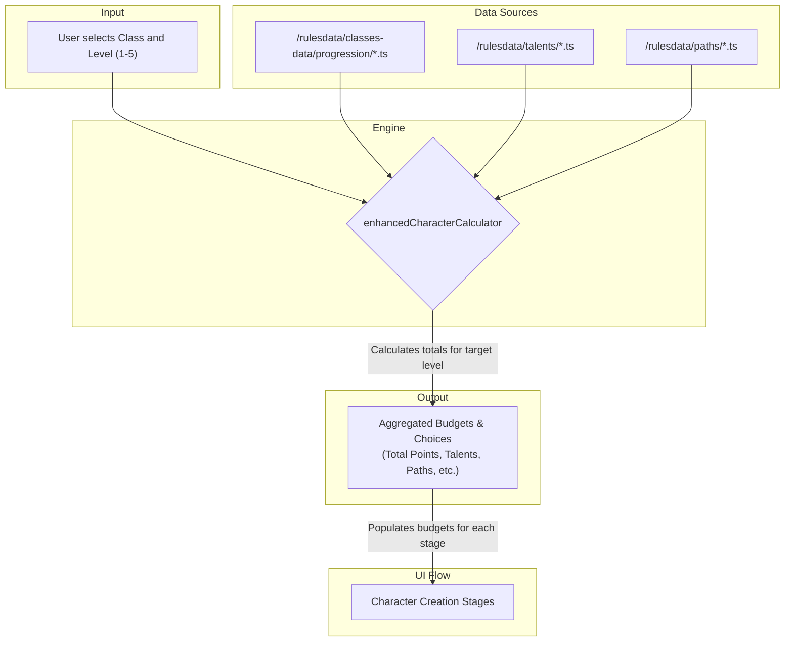

### **File: `docs/systems/LEVELING_SYSTEM.MD`**

```markdown
# DC20Clean – Leveling System (WIP)

> **Purpose**  
> This document is the single authoritative reference (“bible”) for the character leveling system. It outlines the data flow, calculation logic, and UI interactions required to create a character at any level from 1 to 5.
>
> **Status:** 🚧 **Work in Progress** - This specification outlines the planned implementation. It will be updated as milestones are completed.

---

## 1. High-Level Pipeline

The leveling system integrates directly into the character creation flow. It is initiated by a user selecting a target level at the start of the process. The core logic is handled by the `enhancedCharacterCalculator`, which aggregates all stats and choices granted up to that level.



---

## 2. Key Files & Their Roles

| Layer                 | File / Dir                                                              | Responsibility                                                                                             |
| --------------------- | ----------------------------------------------------------------------- | ---------------------------------------------------------------------------------------------------------- |
| **Rule Data**         | `src/lib/rulesdata/classes-data/progression/*.progression.ts`           | **(New)** Defines level-by-level stat gains and choices (Talents, Paths, etc.) for each class.             |
|                       | `src/lib/rulesdata/talents/`                                            | **(New)** Defines all General, Class, and Multiclass Talents.                                              |
|                       | `src/lib/rulesdata/paths/`                                              | Defines the Martial and Spellcaster Path progressions.                                                     |
| **Type Contracts**    | `src/lib/rulesdata/schemas/class.schema.ts`                             | Defines the `LevelGains` and `ClassLevel` interfaces for the new progression files.                        |
|                       | `src/lib/rulesdata/talents/talent.types.ts`                             | Defines the `Talent` interface.                                                                            |
| **Runtime Engine**    | `src/lib/services/enhancedCharacterCalculator.ts`                       | **(To Be Enhanced)** Aggregates all stats and choices from level 1 up to the user's selected target level. |
| **State Layer**       | `src/lib/stores/characterContext.tsx`                                   | Stores the user's target level and all their subsequent choices.                                           |
| **UI**                | `src/routes/character-creation/CharacterCreation.tsx`                   | Orchestrates the multi-stage flow, conditionally showing the new "Leveling Choices" stage.                 |
|                       | `src/routes/character-creation/components/LevelingChoices.tsx`          | **(New)** A dedicated UI component for spending accumulated Talent and Path Points.                        |

---

## 3. Core Mechanics & Logic

### 3.1. Level Selection
-   A dropdown will be added to **Stage 1: Class & Features** allowing the user to select a starting level from 1 to 5.
-   This selection is stored in the `characterContext` and is a primary input for the `enhancedCharacterCalculator`.

### 3.2. Aggregation Engine
-   The calculator will read the character's `classId` and `level`.
-   It will then iterate through the corresponding `...progression.ts` file from `level: 1` to the target `level`.
-   In each iteration, it will sum the values from the `gained...` properties (e.g., `gainedHealth`, `gainedAttributePoints`) and the `gains` object (e.g., `talents`, `pathPoints`).
-   The final output is a single set of budgets that represents the character's total resources for their level.

### 3.3. Conditional "Leveling Choices" Stage
-   This new stage will appear at **Step 2** if the character's target level is greater than 1.
-   It will contain two sections:
    1.  **Talent Selection:** Allows the user to choose from General, Class, and Multiclass talents until their `talentsToChoose` budget is 0.
    2.  **Path Point Allocation:** Allows the user to spend their `pathPointsToSpend` budget on the Martial and Spellcaster paths.
-   The "Next" button for this stage will be disabled until all points are spent.

### 3.4. Dynamic Budgeting in Subsequent Stages
-   **Ancestry (Stage 3):** The "Ancestry Points Remaining" counter will be initialized with `5 + aggregated ancestryPoints`.
-   **Attributes (Stage 4):** The "Attribute Points Remaining" counter will be initialized with `12 + aggregated attributePoints`.
-   **Background (Stage 5):** The Skill, Trade, and Language point counters will be initialized with their base values plus any aggregated points from the progression tables.

---

## 4. Acceptance Criteria

-   A user can select a starting level of 3 for a Barbarian.
-   The "Leveling Choices" stage appears, showing a budget of **1 Talent** and **1 Path Point** to spend (from the Level 2 progression).
-   The "Attributes" stage shows a budget of **13 Attribute Points** (12 base + 1 from Level 3 progression).
-   The final saved character sheet correctly reflects all stats and features for a Level 3 Barbarian.

---

## 5. References

-   `docs/systems/CLASS_SYSTEM.MD` – Defines the class data structure.
-   `docs/systems/EFFECT_SYSTEM.MD` – Defines the `Effect` types used by Talents.
-   `docs/systems/CALCULATION_SYSTEM.MD` – Outlines the core calculation engine that will be enhanced.

---

> _Last updated: September 26, 2025_  
> _Maintainer: @DC20Clean-Team_
