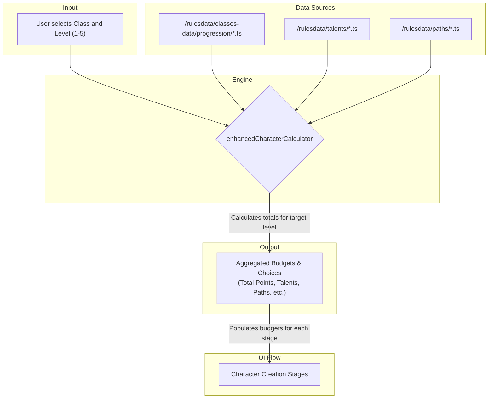

### **File: `docs/systems/LEVELING_SYSTEM.MD`**

````markdown
# DC20Clean – Leveling System

> **Purpose**  
> This document is the single authoritative reference for the character leveling system. It outlines the data flow, calculation logic, and UI interactions required to create a character at any level from 1 to 5.
>
> **Status:** ✅ **Complete** - All core leveling functionality implemented and human-tested. Unit test coverage in progress.
> **Last Updated:** October 10, 2025

---

## 1. High-Level Pipeline

The leveling system integrates directly into the character creation flow. It is initiated by a user selecting a target level at the start of the process. The core logic is handled by the `enhancedCharacterCalculator`, which aggregates all stats and choices granted up to that level.


````

---

## 2. Key Files & Their Roles

| Layer              | File / Dir                                                     | Responsibility                                                                                             |
| ------------------ | -------------------------------------------------------------- | ---------------------------------------------------------------------------------------------------------- |
| **Rule Data**      | `src/lib/rulesdata/classes-data/progression/*.progression.ts`  | **(New)** Defines level-by-level stat gains and choices (Talents, Paths, etc.) for each class.             |
|                    | `src/lib/rulesdata/talents/`                                   | **(New)** Defines all General, Class, and Multiclass Talents.                                              |
|                    | `src/lib/rulesdata/paths/`                                     | Defines the Martial and Spellcaster Path progressions.                                                     |
| **Type Contracts** | `src/lib/rulesdata/schemas/class.schema.ts`                    | Defines the `LevelGains` and `ClassLevel` interfaces for the new progression files.                        |
|                    | `src/lib/rulesdata/talents/talent.types.ts`                    | Defines the `Talent` interface.                                                                            |
| **Runtime Engine** | `src/lib/services/enhancedCharacterCalculator.ts`              | **(To Be Enhanced)** Aggregates all stats and choices from level 1 up to the user's selected target level. |
| **State Layer**    | `src/lib/stores/characterContext.tsx`                          | Stores the user's target level and all their subsequent choices.                                           |
| **UI**             | `src/routes/character-creation/CharacterCreation.tsx`          | Orchestrates the multi-stage flow, conditionally showing the new "Leveling Choices" stage.                 |
|                    | `src/routes/character-creation/components/LevelingChoices.tsx` | **(New)** A dedicated UI component for spending accumulated Talent and Path Points.                        |

---

## 3. Core Mechanics & Logic

### 3.1. Level Selection

- A dropdown will be added to **Stage 1: Class & Features** allowing the user to select a starting level from 1 to 5.
- This selection is stored in the `characterContext` and is a primary input for the `enhancedCharacterCalculator`.

### 3.2. Aggregation Engine

- The calculator will read the character's `classId` and `level`.
- It will then iterate through the corresponding `...progression.ts` file from `level: 1` to the target `level`.
- In each iteration, it will sum the values from the `gained...` properties (e.g., `gainedHealth`, `gainedAttributePoints`) and the `gains` object (e.g., `talents`, `pathPoints`).
- The final output is a single set of budgets that represents the character's total resources for their level.

### 3.3. Conditional "Leveling Choices" Stage

- This new stage will appear at **Step 2** if the character's target level is greater than 1.
- It will contain two sections:
  1.  **Talent Selection:** Allows the user to choose from General, Class, and Multiclass talents until their `talentsToChoose` budget is 0.
  2.  **Path Point Allocation:** Allows the user to spend their `pathPointsToSpend` budget on the Martial and Spellcaster paths.
- The "Next" button for this stage will be disabled until all points are spent.

### 3.4. Path Point Bonuses (M3.9 - ✅ IMPLEMENTED)

Path points grant immediate bonuses to character resources based on allocation:

**Martial Path Progression:**
| Path Level | Stamina Points | Maneuvers Learned | Techniques Learned |
|------------|----------------|-------------------|-------------------|
| 1 | +1 | +1 | +1 |
| 2 | — | +1 | — |
| 3 | +1 | +1 | +1 |
| 4 | — | +1 | — |

**Spellcaster Path Progression:**
| Path Level | Mana Points | Cantrips Learned | Spells Learned |
|------------|-------------|------------------|----------------|
| 1 | +2 | +1 | +1 |
| 2 | +2 | +1 | — |
| 3 | +2 | +1 | +1 |
| 4 | +2 | — | +1 |

**Implementation:**

- Path bonuses are calculated by `aggregatePathBenefits()` in `enhancedCharacterCalculator.ts`
- Bonuses are added to base progression gains in `aggregateProgressionGains()`
- Data source: `src/lib/rulesdata/paths/paths.data.ts`
- Type: `pathPointAllocations?: { martial?: number; spellcasting?: number }` in `EnhancedCharacterBuildData`

**Example (Level 5 Barbarian with 2 martial path points):**

- SP: 1 (L1) + 1 (L3) + 1 (path L1) = **3**
- Maneuvers: 4 (L1) + 1 (L5) + 1 (path L1) + 1 (path L2) = **7**
- Techniques: 1 (L3) + 1 (L5) + 1 (path L1) = **3**

### 3.5. Dynamic Budgeting in Subsequent Stages

- **Ancestry (Stage 3):** The "Ancestry Points Remaining" counter will be initialized with `5 + aggregated ancestryPoints`.
- **Attributes (Stage 4):** The "Attribute Points Remaining" counter will be initialized with `12 + aggregated attributePoints`.
- **Background (Stage 5):** The Skill, Trade, and Language point counters will be initialized with their base values plus any aggregated points from the progression tables.

---

## 4. Acceptance Criteria

- A user can select a starting level of 3 for a Barbarian.
- The "Leveling Choices" stage appears, showing a budget of **1 Talent** and **1 Path Point** to spend (from the Level 2 progression).
- The "Attributes" stage shows a budget of **13 Attribute Points** (12 base + 1 from Level 3 progression).
- The final saved character sheet correctly reflects all stats and features for a Level 3 Barbarian.

---

## 5. References

- `docs/systems/CLASS_SYSTEM.MD` – Defines the class data structure.
- `docs/systems/EFFECT_SYSTEM.MD` – Defines the `Effect` types used by Talents.
- `docs/systems/CALCULATION_SYSTEM.MD` – Outlines the core calculation engine that will be enhanced.

---

## 6. Implementation Status

| Milestone                           | Status      | Description                                                             |
| ----------------------------------- | ----------- | ----------------------------------------------------------------------- |
| M3.9: Combat Mastery & Path Bonuses | ✅ **DONE** | Combat mastery formula fixed, path bonuses integrated into calculations |
| M3.10: Subclass Selection           | 🚧 **NEXT** | UI for subclass choice at level 3, validation, feature application      |

---

> _Last updated: October 2, 2025_  
> _Maintainer: @DC20Clean-Team_

---

## 10. Multiclass System

### 10.1. Overview

The multiclass talent system allows characters to gain features from other classes by spending **Talent Points**. This system is fully integrated into the leveling choices stage.

**Location:** `src/lib/rulesdata/progression/multiclass.ts`

**Detailed Documentation:** See `docs/systems/MULTICLASS_SYSTEM.MD`

### 10.2. Six Multiclass Tiers

| Tier        | Level | Feature Level           | Subclass? | Prerequisites        |
| ----------- | ----- | ----------------------- | --------- | -------------------- |
| Novice      | 2+    | 1st level               | No        | None                 |
| Adept       | 4+    | 2nd level               | No        | None                 |
| Expert      | 7+    | 5th or 3rd subclass     | Yes       | 1+ class features    |
| Master      | 10+   | 6th subclass only       | Yes       | 1+ subclass features |
| Grandmaster | 13+   | 8th level (capstone)    | No        | 2+ class features    |
| Legendary   | 17+   | 9th subclass (capstone) | Yes       | 2+ subclass features |

### 10.3. Implementation Highlights

**UI:**

- Card-based feature selection in `LevelingChoices.tsx`
- Dynamic tier availability based on level
- Prerequisite validation before showing tiers
- Path features automatically filtered out

**Effects:**

- Integrated into `aggregateAttributedEffects()` in calculator
- Multiclass feature effects modify character stats
- Properly attributed for breakdowns and tooltips

**Persistence:**

- Multiclass selections saved to `SavedCharacter`
- Preserved across save/load and level-up
- Fields: `selectedMulticlassOption`, `selectedMulticlassClass`, `selectedMulticlassFeature`

**Testing:**

- 31 unit tests in `multiclass.test.ts`
- All tests passing
- Coverage: data integrity, prerequisites, helper functions

### 10.4. Related Milestones

- **M3.17:** Complete multiclass system implementation
- **Status:** ✅ Done
- **Epic Reference:** `docs/plannedSpecs/LEVELING_EPIC.md` §5.18

---

## 11. System Integration Summary

The leveling system is now a comprehensive, data-driven pipeline that handles:

1. ✅ **Class Selection** - All 14 classes with progression tables
2. ✅ **Level Selection** - Characters from level 1 to 5 (expandable to 20)
3. ✅ **Attribute Caps** - Dynamic caps based on level from `levelCaps.ts`
4. ✅ **Mastery Caps** - Level-based skill/trade mastery limits
5. ✅ **Talent System** - General, class, and multiclass talents
6. ✅ **Path Points** - Martial and Spellcaster path progression
7. ✅ **Subclass Selection** - Dynamic subclass choice at level 3+
8. ✅ **Multiclass Features** - 6-tier multiclass talent system
9. ✅ **Effect Application** - All features apply effects to stats
10. ✅ **Persistence** - Complete save/load/level-up support

**Status:** ✅ Complete - All implementation and testing milestones finished

- See `docs/archive/LEVELING_EPIC.md` for full milestone history

---

```

```
