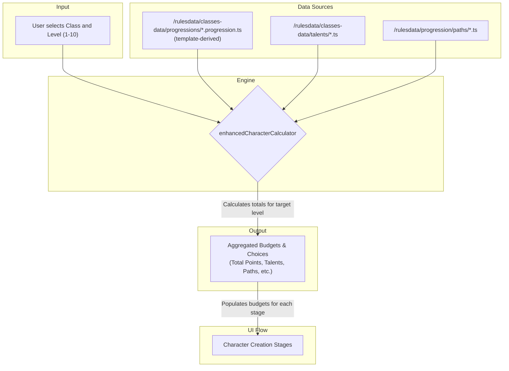

# DC20Clean – Leveling System

> **Purpose**  
> This document is the single authoritative reference for the character leveling system. It outlines the data flow, calculation logic, and UI interactions required to create a character at any level from 1 to 10 (DC20 v0.10.5 max level).
>
> **Status:** ✅ **Complete** - Core leveling functionality implemented with DC20 v0.10.5 progression tables.
> **Last Updated:** 2026-06-18

---

## 1. High-Level Pipeline

The leveling system integrates directly into the character creation flow. It is initiated by a user selecting a target level at the start of the process. The core logic is handled by the `enhancedCharacterCalculator`, which aggregates all stats and choices granted up to that level.


```mermaid
flowchart TD
    subgraph "Input"
        A["User selects Class and Level (1-10)"]
    end

    subgraph "Engine"
        B{"enhancedCharacterCalculator"}
    end

    subgraph "Data Sources"
        C1["/rulesdata/classes-data/progressions/*.progression.ts\n(template-derived)"]
        C2["/rulesdata/classes-data/talents/*.ts"]
        C3["/rulesdata/progression/paths/*.ts"]
    end

    subgraph "Output"
        D["Aggregated Budgets & Choices\n(Total Points, Talents, Paths, etc.)"]
    end

    subgraph "UI Flow"
        E["Character Creation Stages"]
    end

    A --> B
    C1 & C2 & C3 --> B
    B -- "Calculates totals for target level" --> D
    D -- "Populates budgets for each stage" --> E
```

---

## 2. Key Files & Their Roles

| Layer              | File / Dir                                                     | Responsibility                                                                                                                                                      |
| ------------------ | -------------------------------------------------------------- | ------------------------------------------------------------------------------------------------------------------------------------------------------------------- |
| **Rule Data**      | `src/lib/rulesdata/classes-data/progressions/*.progression.ts` | Exports resolved per-class progression arrays. These are generated from shared martial/caster/hybrid templates plus a per-class feature-ID schedule.                |
|                    | `src/lib/rulesdata/classes-data/progressions/templates/`       | Defines the shared v0.10.5 resource and schedule templates used by class progressions.                                                                              |
|                    | `src/lib/rulesdata/classes-data/talents/`                      | Defines all General, Class, and Multiclass Talents. `allTalents` remains compatibility lookup; `selectableTalents` filters deprecated talents from current choices. |
|                    | `src/lib/rulesdata/progression/paths/`                         | Defines the Martial and Spellcaster Path progressions.                                                                                                              |
| **Type Contracts** | `src/lib/rulesdata/schemas/class.schema.ts`                    | Defines the `LevelGains` and `ClassLevel` interfaces for the new progression files.                                                                                 |
|                    | `src/lib/rulesdata/classes-data/talents/talent.types.ts`       | Defines the `Talent` interface.                                                                                                                                     |
| **Runtime Engine** | `src/lib/services/enhancedCharacterCalculator.ts`              | Aggregates all stats and choices from level 1 up to the user's selected target level.                                                                               |
| **State Layer**    | `src/lib/stores/characterContext.tsx`                          | Stores the user's target level and all their subsequent choices.                                                                                                    |
| **UI**             | `src/routes/character-creation/CharacterCreation.tsx`          | Orchestrates the multi-stage flow, conditionally showing the "Leveling" stage.                                                                                      |
|                    | `src/routes/character-creation/LevelingChoices.tsx`            | UI for spending accumulated Talent and Path Points, including current multiclass tiers.                                                                             |

---

## 3. Core Mechanics & Logic

### 3.1. Level Selection

- **Stage 1: Class & Features** lets the user select a starting level from 1 to 10.
- This selection is stored in the `characterContext` and is a primary input for the `enhancedCharacterCalculator`.
- **Note**: DC20 v0.10.5 is a level 1-10 system (not 1-20).

### 3.2. Aggregation Engine

- The calculator reads the character's `classId` and `level`.
- It iterates through the corresponding resolved `...progression.ts` export from `level: 1` to the target `level`.
- Per-class progression exports are generated from the shared martial, caster, or hybrid template and then overlaid with class-specific feature IDs, so resource timing stays centralized while feature unlocks remain class-specific.
- In each iteration, it sums the values from the `gained...` properties (e.g., `gainedHealth`, `gainedAttributePoints`) and the `gains` object (e.g., `talents`, `pathPoints`).
- The final output is a single set of budgets that represents the character's total resources for their level.

### 3.3. Conditional "Leveling Choices" Stage

- This stage appears at **Step 2** if the character's target level is greater than 1.
- It contains two sections:
  1.  **Talent Selection:** Allows the user to choose from General, Class, and Multiclass talents until their `talentsToChoose` budget is 0.
  2.  **Path Point Allocation:** Allows the user to spend their `pathPointsToSpend` budget on the Martial and Spellcaster paths.
- The "Next" button for this stage is disabled until all points are spent.
- Removed v0.10 talents can remain in `allTalents` for saved-character rendering and calculation while `selectableTalents` keeps them hidden from v0.10.5 character creation and level-up selection.

### 3.3.1. DC20 v0.10.5 Level Schedule

The class progression tables use the v0.10.5 schedule:

| Level | Progression Gains                           |
| ----- | ------------------------------------------- |
| 1     | Class Features                              |
| 2     | Class Feature, Talent, Path Progression     |
| 3     | Subclass Feature                            |
| 4     | Talent, 2 Ancestry Points, Path Progression |
| 5     | Class Expert Feature                        |
| 6     | Talent, Path Progression                    |
| 7     | Subclass Expert Feature                     |
| 8     | Talent, 2 Ancestry Points, Path Progression |
| 9     | Class Capstone Feature                      |
| 10    | Subclass Capstone Feature                   |

The current bundled v0.10.5 source schedules level 9 class capstones and level 7/10 subclass features, but does not publish all class/subclass-specific mechanics for those slots. Class capstone records therefore resolve as non-mechanical `Class Capstone (Source Unpublished)` entries at level 9 while preserving legacy IDs; do not fill those slots with invented mechanics.

Resource totals follow the class tables:

| Class Category | Level 1 Resources | Level 10 Resource Totals |
| -------------- | ----------------- | ------------------------ |
| Martial        | 2 SP              | 6 SP                     |
| Spellcaster    | 6 MP              | 21 MP                    |
| Hybrid         | 1 SP, 3 MP        | 3 SP, 11 MP              |

### 3.4. Path Point Bonuses (M3.9 - ✅ IMPLEMENTED)

Path points grant immediate bonuses to character resources based on allocation:

**Martial Path Progression (DC20 v0.10 p.161):**
| Path Level | Stamina Points | Maneuvers Learned |
|------------|----------------|-------------------|
| 1 | +1 | +1 |
| 2 | — | +1 |
| 3 | +1 | +1 |
| 4 | — | +1 |

**Spellcaster Path Progression (DC20 v0.10 p.161):**
| Path Level | Mana Points | Cantrips Learned | Spells Learned |
|------------|-------------|------------------|----------------|
| 1 | +3 | +1 | +1 |
| 2 | +2 | +1 | — |
| 3 | +2 | +1 | +1 |
| 4 | +2 | — | +1 |

**Cross-Path Special Rules (DC20 v0.10 p.161):**

- **Martial classes taking Spellcaster Path:** Gain a Spell List of their choice from any Class when first investing in the path.
- **Spellcaster classes taking Martial Path:** Gain "Spellcaster Stamina Regen" - Once per round, regain up to half maximum SP when using a Spell Enhancement.

**Implementation:**

- Path bonuses are calculated by `aggregatePathBenefits()` in `enhancedCharacterCalculator.ts`
- Cross-path grants returned in `crossPathGrants` object
- Bonuses are added to base progression gains in `aggregateProgressionGains()`
- Data source: `src/lib/rulesdata/progression/paths/paths.data.ts`
- Type: `pathPointAllocations?: { martial?: number; spellcasting?: number }` in `EnhancedCharacterBuildData`

**Example (Level 5 Barbarian with 2 martial path points):**

- SP: 1 (L1) + 1 (L3) + 1 (path L1) = **3**
- Maneuvers: 4 (L1) + 1 (L5) + 1 (path L1) + 1 (path L2) = **7**

### 3.5. Dynamic Budgeting in Subsequent Stages

- **Ancestry (Stage 3):** The "Ancestry Points Remaining" counter initializes with `5 + aggregated ancestryPoints`.
- **Attributes (Stage 4):** The "Attribute Points Remaining" counter initializes with `12 + aggregated attributePoints`.
- **Background (Stage 5):** Skill, Trade, and Language counters initialize with their base values plus aggregated progression points.

---

## 4. Acceptance Criteria

- A user can select a starting level of 3 for a Barbarian.
- The "Leveling Choices" stage appears, showing a budget of **1 Talent** and **1 Path Point** to spend (from the Level 2 progression).
- The "Attributes" stage shows a budget of **13 Attribute Points** (12 base + 1 from Level 3 progression).
- The final saved character sheet correctly reflects all stats and features for a Level 3 Barbarian.

---

## 5. References

- `docs/systems/CLASS_SYSTEM.MD` – Defines the class data structure.
- `docs/systems/EFFECT_SYSTEM.MD` – Defines the `Effect` types used by Talents.
- `docs/systems/CALCULATION_SYSTEM.MD` – Defines the core calculation engine.

---

## 6. Implementation Status

| Milestone                           | Status      | Description                                                             |
| ----------------------------------- | ----------- | ----------------------------------------------------------------------- |
| M3.9: Combat Mastery & Path Bonuses | ✅ **DONE** | Combat mastery formula fixed, path bonuses integrated into calculations |
| M3.10: Subclass Selection           | ✅ **DONE** | UI for subclass choice at level 3, validation, feature application      |

---

> _Last updated: 2026-06-18_
> _Maintainer: @DC20Clean-Team_

---

## 10. Multiclass System

### 10.1. Overview

The multiclass system allows characters to gain features from other classes by spending **Talent Points** acquired through leveling. DC20 v0.10.5 exposes four multiclass tiers. Removed Grandmaster and Legendary definitions remain lookup-only for legacy saved-character compatibility.

---

### 10.2. Multiclass Tiers

#### 10.2.1. Tier Definitions

| Tier       | Level Required | Target Feature Level                 | Subclass Support | Prerequisites                 |
| ---------- | -------------- | ------------------------------------ | ---------------- | ----------------------------- |
| **Novice** | 2              | 1st level core features              | No               | None                          |
| **Adept**  | 4              | 2nd level core features              | No               | None                          |
| **Expert** | 6              | 5th level core OR 3rd level subclass | Yes              | 1+ class features from target |
| **Master** | 8              | 7th level subclass expert feature    | Yes (only)       | 3rd level subclass feature    |

#### 10.2.2. Tier Details

**Novice Multiclass**

- Available at character level 2+
- Select any 1st level class feature from any class
- No prerequisites
- Cost: 1 Talent Point

**Adept Multiclass**

- Available at character level 4+
- Select any 2nd level class feature from any class
- No prerequisites
- Cost: 1 Talent Point

**Expert Multiclass**

- Available at character level 6+
- Select either:
  - A 5th level core class feature, OR
  - A 3rd level subclass feature
- Prerequisite: Must have at least 1 class feature from the target class
- Cost: 1 Talent Point

**Master Multiclass**

- Available at character level 8+
- Select a 7th level subclass expert feature (subclass features only)
- Prerequisite: Must have the target subclass's 3rd level feature
- Cost: 1 Talent Point

**Removed legacy tiers**

- Grandmaster and Legendary Multiclass are not selectable in v0.10.5.
- Their definitions and talent records remain loadable so existing v0.10 characters can be classified as upgrade-required without losing historical selections.

---

### 10.3. Implementation

#### 10.3.1. Data Structure

**Location:** `src/lib/rulesdata/progression/multiclass.ts`

```typescript
export type MulticlassTier = 'novice' | 'adept' | 'expert' | 'master' | 'grandmaster' | 'legendary';

export interface MulticlassTierDefinition {
	id: MulticlassTier;
	name: string;
	levelRequired: number;
	description: string;
	targetLevel: number; // Feature level to select
	includeSubclass: boolean; // Whether subclass features are available
	subclassLevel?: number; // Subclass feature level if applicable
	subclassOnly?: boolean; // If true, ONLY subclass features (no core)
	minClassFeatures: number; // Prerequisite: min class features owned
	minSubclassFeatures: number; // Prerequisite: min subclass features owned
}

export const MULTICLASS_TIERS: MulticlassTierDefinition[];
export const LEGACY_MULTICLASS_TIERS: MulticlassTierDefinition[];
export const ALL_MULTICLASS_TIERS: MulticlassTierDefinition[];
export function getMulticlassTier(tierId: MulticlassTier): MulticlassTierDefinition | undefined;
export function getAvailableMulticlassTiers(characterLevel: number): MulticlassTierDefinition[];
```

#### 10.3.2. UI Flow

**Location:** `src/routes/character-creation/LevelingChoices.tsx`

1. User selects character level during creation
2. System calculates available multiclass tiers based on level
3. UI displays only tiers meeting level requirements
4. System validates prerequisites (feature ownership)
5. Eligible classes filtered based on prerequisite counts
6. User selects class from dropdown
7. System displays available features as cards:
   - Core class features (if applicable)
   - Subclass features (if tier supports them)
8. User clicks feature card to select
9. Selection persisted to character context

**Feature Display:**

- Each feature shown as an expandable card
- Card shows: Feature name, level, full description
- Selected feature highlighted with a "Selected" badge
- Path-related features (Martial Path, Spellcaster Path) automatically filtered out

#### 10.3.3. Effects Application

**Location:** `src/lib/services/enhancedCharacterCalculator.ts`

Multiclass feature effects are applied in `aggregateAttributedEffects()`:

1. Reads `selectedMulticlassFeature` and `selectedMulticlassClass` from build data
2. Loads class definition using `findClassByName()`
3. Finds selected feature in class's `coreFeatures` array
4. Extracts feature's `effects` array
5. Adds each effect to the effects pipeline with source type `'multiclass_feature'`
6. Effects resolve alongside trait, talent, and class effects
7. Final stats reflect multiclass feature bonuses

**Effect Attribution:**

```typescript
{
  source: {
    type: 'multiclass_feature',
    id: `multiclass_${classId}_${featureName}`,
    name: featureName,
    description: feature.description,
    category: 'Multiclass Feature'
  },
  resolved: !effect.userChoice,
  dependsOnChoice: effect.userChoice ? `multiclass_${featureName}` : undefined
}
```

#### 10.3.4. Persistence

**Location:** `src/lib/services/characterCompletion.ts`, `src/lib/types/dataContracts.ts`

Multiclass selections saved to `SavedCharacter`:

```typescript
interface SavedCharacter {
	// ... other fields
	selectedMulticlassOption?:
		| 'novice'
		| 'adept'
		| 'expert'
		| 'master'
		| 'grandmaster'
		| 'legendary'
		| null;
	selectedMulticlassClass?: string; // Class ID
	selectedMulticlassFeature?: string; // Feature name
}
```

Selections persist across:

- Character save
- Character load
- Level-up respeccing
- Character export

---

### 10.4. Prerequisites & Validation

#### 10.4.1. Prerequisite Checks

**Feature Counting:**

```typescript
// Count class features from main class progression
getOwnedClassFeatures(classId): number {
  if (classId === mainClassId) {
    return resolvedProgression.unlockedFeatureIds.length;
  }
  // Persisted state currently supports one multiclass selection.
  return 0;
}

// Estimate subclass features based on level
getOwnedSubclassFeatures(classId): number {
  if (classId === mainClassId && hasSubclass && level >= 3) {
    return [3, 7, 10].filter(l => l <= level).length;
  }
  return 0;
}
```

**Tier Validation:**

```typescript
meetsMulticlassPrerequisites(tier): boolean {
  // Check level
  if (level < tier.levelRequired) return false;

  // Check feature count prerequisites
  if (tier.minClassFeatures > 0) {
    return getOwnedClassFeatures(mainClassId) >= tier.minClassFeatures;
  }

  if (tier.minSubclassFeatures > 0) {
    return getOwnedSubclassFeatures(mainClassId) >= tier.minSubclassFeatures;
  }

  return true;
}
```

**Class Filtering:**

```typescript
getEligibleClasses(): ClassData[] {
  // Novice/Adept: All classes
  if (tier.minClassFeatures === 0 && tier.minSubclassFeatures === 0) {
    return allClasses;
  }

  // Expert: Only classes with N+ class features
  if (tier.minClassFeatures > 0) {
    return allClasses.filter(cls =>
      getOwnedClassFeatures(cls.id) >= tier.minClassFeatures
    );
  }

  // Master: Only classes with the required subclass feature
  return allClasses.filter(cls =>
    getOwnedSubclassFeatures(cls.id) >= tier.minSubclassFeatures
  );
}
```

#### 10.4.2. Current Limitations

- Prerequisite checks only count features from **main class**
- Multiclass feature ownership not yet tracked
- Per-class validation not yet per-class (checks global count)
- Multiple independently sourced multiclass selections require a future persistence expansion

---

### 10.5. Subclass Feature Support

#### 10.5.1. Tiers with Subclass Support

**Expert (Level 6):**

- Shows both core features (level 5) AND subclass features (level 3)
- User can choose either type
- Subclass features prefixed with subclass name: "Berserker: Rage Enhancement"

**Master (Level 8):**

- Shows ONLY subclass expert features (level 7)
- No core class features available
- Must have the target subclass's level 3 feature

#### 10.5.2. Feature Display Format

```typescript
// Subclass features prefixed for clarity
{
  featureName: `${subclassName}: ${originalFeatureName}`,
  description: `${subclassDescription}\n\n${featureDescription}`.trim(),
  // ... other feature properties
}
```

---

### 10.6. Testing

#### 10.6.1. Unit Tests

**Location:** `src/lib/rulesdata/progression/multiclass.test.ts`

**Coverage:** 30 tests

- Data integrity (4 current tiers plus 2 legacy lookup tiers, unique IDs, ordering)
- Current and legacy tier property validation
- Prerequisite requirement verification
- `getMulticlassTier()` functionality
- `getAvailableMulticlassTiers()` level filtering
- Subclass support flag validation

**Run Tests:**

```bash
npx vitest run --project server src/lib/rulesdata/progression/multiclass.test.ts
```

#### 10.6.2. Manual Testing Checklist

- [ ] Level 2 character sees only Novice tier
- [ ] Level 4 character sees Novice + Adept
- [ ] Level 6 character sees first 3 tiers
- [ ] Expert tier shows both core and subclass features
- [ ] Master tier shows only subclass features
- [ ] Selected feature persists after save
- [ ] Multiclass effects apply to character stats
- [ ] Level-up preserves multiclass selection
- [ ] Path features filtered from selection

---

### 10.7. Future Enhancements

#### 10.7.1. Planned Features

1. **Multiclass Feature Tracking**
   - Track which class/subclass each multiclass feature came from
   - Enable proper prerequisite validation per source class
   - Support multiple multiclass features from different classes

2. **Advanced Prerequisites**
   - "Must have 1 feature from THIS class" (not just ANY class)
   - "Must have 1 subclass feature from THIS subclass"
   - Track feature sources for accurate validation

3. **Feature Choice Resolution**
   - Handle multiclass features with nested choices
   - Store and apply choice-based effects
   - UI for resolving multiclass feature choices

4. **Multiple Multiclass Selections**
   - Allow spending multiple talent points on multiclass
   - Track multiple multiclass features simultaneously
   - Manage complex prerequisite chains

---

### 10.8. Related Systems

- **Talent System** (`src/lib/rulesdata/classes-data/talents/`) - Source of talent points
- **Effect System** (`src/lib/types/effectSystem.ts`) - Effect application framework
- **Calculator** (`src/lib/services/enhancedCharacterCalculator.ts`) - Stat calculation
- **Character Context** (`src/lib/stores/characterContext.tsx`) - State management
- **Level Caps** (`src/lib/rulesdata/progression/levelCaps.ts`) - Level-based limits

---

### 10.9. References

- **Milestone:** M3.17 in `docs/archive/LEVELING_EPIC.md`
- **Commits:** `a28e057`, `3c9deed`, `2764c1f`, `e017d8d`, `37916de`, `ddcfe11`, `5b6da20`, `6f0de71`
- **Tests:** `src/lib/rulesdata/progression/multiclass.test.ts` (31 tests)

---

## 11. System Integration Summary

The leveling system is now a comprehensive, data-driven pipeline that handles:

1. ✅ **Class Selection** - All 13 classes with progression tables (v0.10)
2. ✅ **Level Selection** - Characters from level 1 to 10 (DC20 v0.10 max)
3. ✅ **Attribute Caps** - Dynamic caps based on level from `levelCaps.ts`
4. ✅ **Mastery Caps** - Level-based skill/trade mastery limits
5. ✅ **Talent System** - General, class, and multiclass talents
6. ✅ **Path Points** - Martial and Spellcaster path progression
7. ✅ **Subclass Selection** - Dynamic subclass choice at level 3+
8. ✅ **Multiclass Features** - 6-tier multiclass talent system
9. ✅ **Effect Application** - All features apply effects to stats
10. ✅ **Persistence** - Complete save/load/level-up support

**Status:** ✅ Complete - All implementation and testing milestones finished. DC20 v0.10 compliant.

- See `docs/archive/LEVELING_EPIC.md` for full milestone history
- See `docs/archive/LEVELING_GAPS_SPEC.md` for v0.10 compliance fixes (29 gaps addressed)

---

```

```
