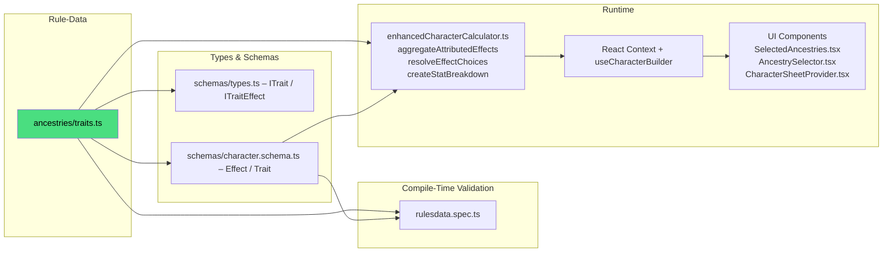

# DC20Clean – Traits System (Vertical Slice)

> Purpose  
> This document is the single authoritative reference ("bible") for everything related to Traits: their data shape, effect typing, validation, runtime processing, and UI usage.
> • Humans can follow the numbered guides & check-lists.  
> • AI agents can parse the File Maps and Mermaid graphs to discover dependencies.

---

## 1 High-Level Pipeline



---

## 2 Key Files & Their Roles

| Layer                 | File / Dir                                                                                | Responsibility                                             |
| --------------------- | ----------------------------------------------------------------------------------------- | ---------------------------------------------------------- |
| Rule Data (canonical) | `src/lib/rulesdata/ancestries/traits.ts`                                                  | Declarative list of `traitsData` objects                   |
| Type Contracts        | `src/lib/rulesdata/schemas/types.ts`                                                      | TS interfaces `ITrait`, `ITraitEffect` (legacy/aux typing) |
|                       | `src/lib/rulesdata/schemas/character.schema.ts`                                           | Canonical `Effect` union and `Trait` interface             |
| Validation Tests      | `src/lib/rulesdata/rulesdata.spec.ts`                                                     | Loads trait data and asserts required fields are present   |
| Runtime Engine        | `src/lib/services/enhancedCharacterCalculator.ts`                                         | Aggregates effects, resolves choices, computes breakdowns  |
| State Layer           | `src/lib/stores/characterContext.tsx`<br>`src/lib/hooks/useCharacterBuilder.ts`           | Provides calculated results and selected choices to UI     |
| UI                    | `src/routes/character-creation/*` (selection)<br>`src/routes/character-sheet/*` (display) | Components import `traitsData` results via context         |

Notes:

- Use `schemas/character.schema.ts` as the source of truth for `Effect.type` strings. See also `docs/systems/EFFECT_SYSTEM.MD`.
- `traits.ts` currently imports `Trait` from `schemas/character.schema.ts` to ensure alignment.
- For resource maximums, use `hpMax`, `spMax`, and `mpMax` as `target` values. Avoid `mp` (not processed for maximums).

### Acceptance Criteria (Traits)

- Numeric effects targeting `hpMax|spMax|mpMax` appear in breakdowns and affect final maxima.
- Choice-based effects (`any_attribute`, `any_skill`, `any_trade`) prompt once and persist to the calculated result.

---

## 3 Adding New Trait – Checklist ✅

1. Data  
   1.1 Append the trait object to `ancestries/traits.ts`  
   – Required fields: `id`, `name`, `description`, `cost`, `effects: Effect[]`.  
   – Optional flags: `isMinor`, `isNegative`, `prerequisites: string[]`.

2. IDs & Conventions  
   – Prefer `id = '<ancestryId>_<snake_case_trait>'` for ancestry-tied traits.  
   – Keep `target` values consistent with calculator expectations (e.g., `hpMax`, `pd`, `moveSpeed`, `attributePoints`, `any_attribute`, `any_skill`).

3. Effects  
   – Reuse existing `Effect.type` strings from `schemas/character.schema.ts` whenever possible.  
   – If a new mechanic is truly needed, see §4 before merging.

4. Choice-based Traits  
   – If the effect requires player input, add `userChoice` to the effect: `{ prompt, options? }`.  
   – `resolveEffectChoices` currently resolves:  
    • `MODIFY_ATTRIBUTE` with `target: 'any_attribute'`  
    • `GRANT_SKILL_EXPERTISE` with `target: 'any_skill'`  
    • `GRANT_TRADE_EXPERTISE` with `target: 'any_trade'`  
   – If you introduce a new "any\_\*" pattern, extend `resolveEffectChoices` and `getOptionsForEffect` accordingly.

5. Calculator Support  
   – Numeric buffs/debuffs → ensure the `target` is recognized by `createStatBreakdown` or aggregated in `calculateCharacterWithBreakdowns`.  
   – Abilities, senses, movements, resistances → use the corresponding `GRANT_*` effect types; they are collected for display.

6. UI  
   – No UI changes typically required; components consume calculated results via context.  
   – For new choice prompts, ensure your `userChoice.prompt` is user-friendly.

7. Tests  
   – Run `npm run test:unit`; `rulesdata.spec.ts` will fail on missing fields.  
   – Add a calculator test if your trait introduces novel numeric interactions.

8. Docs  
   – If the trait creates a new general mechanic, document it under §4.

9. Commit Message Template
   ```
   feat(rules): add <TraitName> trait
   - traits.ts: +1 entry (<ancestryId>_<trait_id>)
   - tests: verify structure & calculations
   ```

---

## 4 Adding New Trait Effect Type – Decision Matrix

| Question                                           | Yes                                                                 | No                                      |
| -------------------------------------------------- | ------------------------------------------------------------------- | --------------------------------------- |
| Does an existing `Effect.type` cover the mechanic? | Use it → go to Step 5                                               | Create new type → continue              |
| Does the effect alter a numeric stat?              | Implement in calculator (`createStatBreakdown` or dedicated)        | Use `GRANT_ABILITY` + manual rules text |
| Does the UI need to resolve user choice?           | Add `effect.userChoice` and extend `resolveEffectChoices` if needed | —                                       |

When a new type is created:

1. Extend the `Effect.type` union in `schemas/character.schema.ts`.
2. Implement handling in `enhancedCharacterCalculator.ts` (aggregation and/or breakdown).
3. Update any helpers (`getOptionsForEffect`, `resolveEffectChoices`) if choices are involved.
4. Write unit tests.

---

## 5 Troubleshooting FAQ 🤖

| Symptom                                   | Likely Cause                                         | Fix                                                                                            |
| ----------------------------------------- | ---------------------------------------------------- | ---------------------------------------------------------------------------------------------- |
| Trait not visible / loaded                | Not added to `ancestries/traits.ts` or `id` mismatch | Verify entry and `id` format                                                                   |
| Unit test `rulesdata.spec.ts` fails       | Missing required fields or malformed `effects`       | Ensure `id`, `name`, `cost`, and `effects[]` are present                                       |
| Stats not updating for new numeric effect | `target` not recognized in calculator                | Map `target` in `createStatBreakdown` or associated aggregators (e.g., `finalAttributePoints`) |
| Choice prompt not appearing in UI         | `effect.userChoice` missing or unresolved            | Add `userChoice`; ensure `resolveEffectChoices` supports target                                |
| Vite import error for traits              | Import path typo                                     | Use `ancestries/traits`                                                                        |

---

## 6 Testing 🧪

### 6.1 Test Suite

**Location**: `src/lib/rulesdata/ancestries/ancestries.test.ts`

**Coverage**: 34 comprehensive tests validating all trait data.

#### Test Categories

**Trait Data Structure**

- ✅ Trait data loads successfully (239 traits)
- ✅ Required fields present (`id`, `name`, `description`, `cost`, `effects`)
- ✅ Unique trait IDs (no duplicates)
- ✅ Valid cost values (numeric)
- ✅ Non-empty effects arrays

**ID Format & Naming**

- ✅ `ancestry_trait` naming convention followed
- ✅ Trait ID prefixes match ancestry IDs (e.g., `human_*`, `elf_*`)

**Trait-to-Ancestry Relationships**

- ✅ Zero orphaned traits (all traits referenced by at least one ancestry)
- ✅ All trait references resolve to existing traits
- ✅ No duplicates in trait lists

**Effect Validation**

- ✅ Only valid effect types used (see `EFFECT_SYSTEM.MD`)
- ✅ Valid target values for `MODIFY_STAT` effects
- ✅ Numeric values for numeric effect types
- ✅ Proper `userChoice` structure for choice-based effects
- ✅ **All effects have required `target` field** (not `count` or `options`)

**Cost & Budget**

- ✅ Valid costs for negative traits (negative values, `isNegative: true`)
- ✅ Consistent cost structure across all traits
- ✅ Default trait costs sum correctly for each ancestry

**Statistics**

- 17 ancestries defined
- 239 traits defined
- Effect type distribution tracked
- Cost distribution tracked

### 6.2 Running Tests

```bash
# Run ancestry & trait tests
npm run test:unit -- ancestries.test.ts

# With detailed output
npm run test:unit -- ancestries.test.ts --reporter=verbose

# Watch mode (for development)
npm run test:unit -- ancestries.test.ts --watch
```

### 6.3 Test-Driven Data Quality

The test suite enforces strict data quality:

- **No orphaned traits**: Every trait must be used by at least one ancestry
- **Strict schema**: All effects must have `type`, `target`, and `value`
- **Naming conventions**: Trait IDs must follow `ancestry_trait` pattern
- **Required fields**: Missing `id`, `name`, `cost`, or `effects` fails tests
- **Valid references**: All trait IDs in ancestry lists must exist

### 6.4 When Tests Fail

| Test Failure                            | Fix                                                            |
| --------------------------------------- | -------------------------------------------------------------- |
| "should have unique trait IDs"          | Remove duplicate trait definition                              |
| "should reference only existing traits" | Fix typo in trait ID or create missing trait                   |
| "should not have orphaned traits"       | Add trait to an ancestry's trait list or remove unused trait   |
| "should have valid effect structure"    | Add `target` field to effect (not `count` or inline `options`) |
| "should follow ancestry_trait naming"   | Rename trait ID to match `ancestry_trait` pattern              |

---

## 7 Future Evolution

- Effect Processor unification may centralize trait effect resolution across ancestries and classes.
- Schema-driven editors may auto-render trait forms from `Trait` and `Effect` metadata.
- Integration tests may validate that trait effects correctly modify character stats in the calculator.

---

> Last updated: 2025-10-08  
> Maintainer: @DC20Clean-Team
